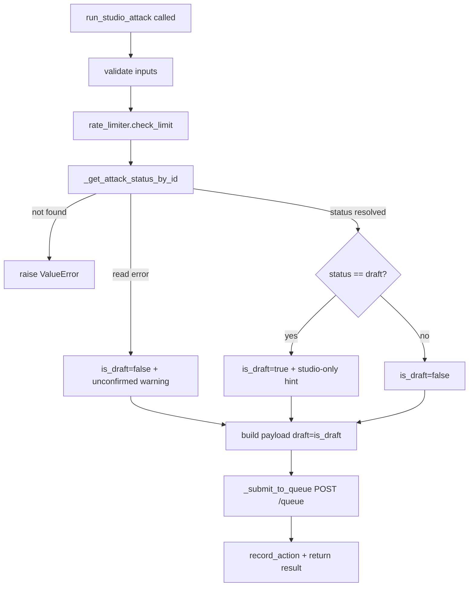

# run_studio_attack Draft-Mode Fix — SAF-31468

## 1. Overview

- **Title:** `run_studio_attack` Draft-Mode Fix — SAF-31468
- **Task Type:** Bug fix (with a small extract-helper refactor)
- **Purpose:** Custom Breach Studio attacks executed via HELM through the MCP `run_studio_attack` tool run
  successfully but never appear in the Test Results / test history UI, because the tool always queues them with
  `"draft": true`. Make the draft flag follow the attack's real publication status so runs of PUBLISHED attacks
  are discoverable in Test Results, just like a UI "quick run".
- **Target Consumer:** Internal — HELM (Breach-genie AI agent) users and SafeBreach customers using the MCP
  Studio tools; SE/Support reproducing custom-attack runs.
- **Target Roles (RBAC):** Same as existing Studio execution (test execute / content read); no new roles.
- **Key Benefits:**
  1. HELM-launched runs of PUBLISHED custom attacks are visible in Test Results (parity with UI quick-run).
  2. DRAFT runs get an explicit, honest warning instead of silently disappearing.
  3. Behavior of the `draft` flag becomes correct-by-construction (tied to attack status), removing a class of
     "where did my run go?" confusion.
- **Business Alignment:** Supports the HELM Automation initiative (related: SAF-31110) by making agent-driven
  custom-attack execution trustworthy and observable.
- **Originating Request:** [SAF-31468](https://safebreach.atlassian.net/browse/SAF-31468) (Bug, High). Reproduced
  by Jondi Tsveniashvili (attack `10000026` / test `1779631053907.18`) and Hadas Cohen (attack `10004721` /
  test `1780579449522.31`).

## 1.5 Document Status

| Field | Value |
|-------|-------|
| **PRD Status** | In Progress |
| **Last Updated** | 2026-06-16 13:55 |
| **Owner** | Yossi Attas |
| **Current Phase** | Phase 3 of 3 — optional (Phases 1-2 complete) |

## 2. Solution Description

### Chosen Solution
In `safebreach_mcp_studio/studio_functions.py`, stop hardcoding `"draft": True` in the `sb_run_studio_attack`
queue payload. Instead:

1. Add a small helper `_get_attack_status_by_id(attack_id, console)` that returns the attack's current
   `(status, name)` by reusing the existing content-API list-and-filter pattern already used by
   `sb_set_studio_attack_status`.
2. In `sb_run_studio_attack`, resolve the status after the rate-limit `check_limit` gate and before building the
   payload. Set `plan.draft = (status == "draft")` — i.e. PUBLISHED attacks queue with `draft = false`.
3. When the attack is DRAFT, attach a `hint_to_agent` to the result explaining the run is visible only in Breach
   Studio (not Test Results) and recommending publishing first via `set_studio_attack_status`; also expose the
   resolved `draft` value in the result dict.
4. Failure handling: attack **not found** → raise a clear `ValueError`; the status **read itself failing** →
   proceed as PUBLISHED (`draft = false`) and add a warning hint that publication status could not be confirmed.

No change to the tool's public signature. No data-server change (Test Results visibility is governed server-side
by the draft tag the MCP sends).

### Alternatives Considered
| Alternative | Pros | Cons | Verdict |
|-------------|------|------|---------|
| Auto-publish a DRAFT attack before running | Run would appear in Test Results | Publishing has production impact and requires explicit confirmation (saf-28235:267); silent publish is unsafe | Rejected |
| Add a new `draft`/run-mode parameter to the tool | Explicit caller control | Adds API surface; auto-resolve already covers the real cases | Rejected (auto-resolve, no signature change) |
| Refuse to run DRAFT attacks entirely | Guarantees no hidden runs | Breaks the legitimate Studio draft-testing flow | Rejected |
| Always omit `draft` | Simplest | DRAFT attacks genuinely require `draft:true` to execute (saf-28235:253) | Rejected |

### Decision Rationale
Tying the flag to the attack's real status fixes the root cause for the common case (PUBLISHED attacks → visible)
while preserving the legitimate DRAFT-testing path with an honest warning — and avoids the production risk of
auto-publishing or the API-surface cost of a new parameter. Confirmed against canonical platform behavior via
Sigi: *"For draft custom breach methods, results only appear in Breach Studio; for published custom breach
methods, results appear in Simulation Results like all other published attacks."*

## 3. Core Feature Components

### Component A: `_get_attack_status_by_id` helper (new, internal)
- **Purpose:** Resolve a single attack's current publication status by ID without duplicating HTTP/filter code.
- **Key Features:**
  - Inputs: `attack_id: int`, `console: str`. Output: tuple `(status: str, name: str)` with lowercase status
    (`"draft"` | `"published"`).
  - Calls `GET {config_base_url}/api/content/v1/accounts/{account_id}/customMethods?status=all` using
    `get_api_base_url(console, 'config')`, `get_api_account_id`, `get_auth_headers_for_console`, and
    `check_rbac_response` — mirroring `sb_set_studio_attack_status:1632-1661`.
  - Iterates `data[]`, matches `attack.get("id") == attack_id`. Raises `ValueError` if not found.
  - Lets `requests`/RBAC exceptions propagate to the caller (caller decides degraded behavior).

### Component B: `sb_run_studio_attack` draft-conditional logic (modify existing)
- **Purpose:** Queue with the correct `draft` value and surface honest guidance for draft runs.
- **Key Features:**
  - After `rate_limiter.check_limit` (~line 1232) and before payload build (~1265), resolve status via Component A
    inside a try/except: on `ValueError` (not found) re-raise a clear error; on read failure, set
    `is_draft = False` and record a "status-unconfirmed" warning.
  - Payload line 1281 becomes `"draft": is_draft` (was `True`).
  - Result dict gains `draft: is_draft`; when `is_draft` (or status unconfirmed), gains `hint_to_agent` with the
    appropriate message.
  - Rate-limit `record_action` and `_submit_to_queue` call are unchanged.

## 4. API Endpoints and Integration

**Existing APIs consumed (no new APIs):**

- **List custom methods (read attack status)** — *newly consumed by `run_studio_attack`*
  - `GET {config_base_url}/api/content/v1/accounts/{account_id}/customMethods?status=all`
  - Headers: `x-apitoken` (via `get_auth_headers_for_console`).
  - Response (essential fields): `{"data": [ { "id": <int>, "name": "<str>", "status": "draft"|"published", ... } ]}`
  - Source: SafeBreach content-manager API (already used by `sb_get_all_studio_attacks:880` and
    `sb_set_studio_attack_status:1637`).
- **Queue test (unchanged)**
  - `POST {base_url}/api/orch/v4/accounts/{account_id}/queue?enableFeedbackLoop=true&retrySimulations=false`
  - Payload: `{"plan": {"name", "steps":[...], "draft": <bool>}}` — only the `draft` value changes (now conditional).

## 5. Example Agent Flow (HELM)

**Primary scenario — PUBLISHED attack (the fix):**
1. HELM publishes a custom attack (DRAFT → PUBLISHED) and calls `run_studio_attack(attack_id, …)`.
2. The tool resolves status = `published`, queues with `draft = false`, returns `{test_id, …, draft: false}`.
3. HELM reports COMPLETED with the Run ID. The user opens Test Results → **the run is present** under that
   planRunId (also returned by `get_tests`).

**Alternative scenario — DRAFT attack (honest warning):**
1. HELM calls `run_studio_attack` on an attack still in DRAFT.
2. The tool resolves status = `draft`, queues with `draft = true`, returns `{…, draft: true, hint_to_agent: "…visible
   only in Breach Studio, not Test Results; publish via set_studio_attack_status to make it discoverable."}`.
3. HELM relays the warning; results remain retrievable via `get_studio_attack_latest_result`.

**Error/edge scenarios:**
- Attack ID not found → tool raises a clear error ("Attack {id} not found on console '{console}'").
- Status read fails (API/RBAC/parse error) → tool proceeds with `draft = false` and adds a hint that publication
  status could not be confirmed.

## 6. Non-Functional Requirements

**Technical Constraints**
- **Backward compatibility:** `run_studio_attack` signature and existing successful-call return keys are preserved;
  `draft` and (conditionally) `hint_to_agent` are additive keys. `run_scenario` / `run_adhoc_scenario` untouched.
- **Integration:** reuses existing core helpers (`get_api_base_url`, `get_api_account_id`,
  `get_auth_headers_for_console`, `check_rbac_response`).

**Performance**
- Adds exactly one `GET /customMethods?status=all` per run (timeout 120s, consistent with existing calls). Negligible
  vs. the queued test's runtime; acceptable since runs are low-frequency, rate-limited operations.

**Security & Compliance**
- No new secrets or auth paths; same per-console token and RBAC enforcement (`check_rbac_response`) as the existing
  status-read path.

**Monitoring & Observability**
- Log the resolved status and the chosen draft value at INFO; log read failures at WARNING/ERROR with the
  degraded-path decision.

## 7. Definition of Done

**Core Functionality**
- [x] `run_studio_attack` against a PUBLISHED attack queues with `plan.draft = false` (unit-verified; full
      Test-Results visibility confirmed by the pending E2E on a real console).
- [x] `run_studio_attack` against a DRAFT attack queues with `plan.draft = true` and returns a `hint_to_agent`
      stating results are Studio-only and recommending publishing first.
- [x] Attack-not-found raises a clear error; status-read failure proceeds as published with an "unconfirmed" warning.
- [x] Result dict exposes the resolved `draft` value.
- [x] `run_scenario` and `run_adhoc_scenario` behavior unchanged (full cross-server suite green).

**Quality Gates**
- [x] New + updated unit tests pass; existing `TestRunStudioAttack` suite updated and green.
- [x] Unit coverage maintained or improved for `studio_functions.py` (1147 cross-server tests pass).
- [x] CLAUDE.md tool description for `run_studio_attack` updated to document status-aware draft behavior.

**Deployment Readiness**
- [x] E2E/manual verification on a real console with a freshly published attack (never run as draft) confirms
      Test-Results visibility. *(PASSED on `pentest01`: attack `10004982` / test `1781613591211.39` queued with
      `draft=False` and appeared in the `get_tests` listing after ~2 poll attempts.)*
- [ ] Changelog/version bump handled via the standard `mcp-create-release` flow.

## 8. Testing Strategy

**Unit Testing** (`safebreach_mcp_studio/tests/test_studio_functions.py`, framework: pytest)
- **Update existing `TestRunStudioAttack` (1396-1574):** every test now triggers a `requests.get`, so add a
  `@patch('safebreach_mcp_studio.studio_functions.requests.get')` mock returning an attack object with a chosen
  `status`. Update `test_run_simulation_all_connected` assertion at **line 1445** (`draft is True`) to reflect the
  mocked status (published → `False`).
- **New cases:**
  1. PUBLISHED attack → payload `plan.draft is False`; no draft `hint_to_agent`; result `draft == False`.
  2. DRAFT attack → payload `plan.draft is True`; `hint_to_agent` present mentioning Breach Studio / Test Results;
     result `draft == True`.
  3. Attack not found in list → `ValueError` raised; `requests.post` (queue) never called.
  4. Status GET raises `RequestException` → payload `plan.draft is False`; "status unconfirmed" warning present;
     run still queued.
- **Helper tests for `_get_attack_status_by_id`:** returns lowercase status + name for a matching id; raises
  `ValueError` when absent; propagates request exceptions.
- Reuse the existing `mock_getall_response` fixture (`152-197`) shape for status-list mocks.

**Integration / E2E**
- Mark E2E (`@pytest.mark.e2e`, `@skip_e2e`): on `E2E_CONSOLE`, publish a brand-new attack, run via
  `run_studio_attack`, then assert it appears via `get_tests` for the returned planRunId.

**Coverage Gaps:** UI-side Test Results rendering is out of scope (server-driven; not in this repo).

## 9. Implementation Phases

| Phase | Status | Completed | Commit SHA | Notes |
|-------|--------|-----------|------------|-------|
| Phase 1: Add `_get_attack_status_by_id` helper | ✅ Complete | 2026-06-16 | `9f6af70` | `TestGetAttackStatusById` (4 unit) green; full studio suite 465 passed |
| Phase 2: Make `run_studio_attack` draft conditional + warnings | ✅ Complete | 2026-06-16 | `faf10d1` | unit green (TestRunStudioAttack incl. 4 new + TestExplicitSimulatorSelection updated); cross-server suite 1147 passed; CLAUDE.md updated; **E2E PASSED on pentest01** (test 1781613591211.39 visible in listing) |
| Phase 3 (optional): Refactor `set_studio_attack_status` to reuse helper | ⏳ Pending | - | - | sign-off: `TestSetStudioAttackStatus` regression green + lint |

### Phase 1: Add `_get_attack_status_by_id` helper
- **Semantic Change:** Introduce a reusable internal helper that returns one attack's current status by ID.
- **Deliverables:** New module-level function in `studio_functions.py`.
- **Implementation Details:**
  - Function `_get_attack_status_by_id(attack_id, console)` returning `(status, name)`.
  - Build base URL/account/headers exactly as `sb_set_studio_attack_status` does (`config` service base URL).
  - GET the `customMethods?status=all` list, run `check_rbac_response`, read `data` (handle dict-wrapper vs raw list).
  - Iterate to find `id == attack_id`; return lowercase `status` and `name`. Raise `ValueError` with a clear message
    if not found. Do not catch request exceptions here — let them propagate.
  - Inputs: `attack_id: int`, `console: str`. Output: `(str, str)`. Errors: `ValueError` (not found), `requests`
    exceptions (propagated).
- **Changes:**
  | File | Change |
  |------|--------|
  | `safebreach_mcp_studio/studio_functions.py` | Add `_get_attack_status_by_id` helper |
  | `safebreach_mcp_studio/tests/test_studio_functions.py` | Add helper unit tests (new `TestGetAttackStatusById` class) |
- **Test Automation (sign-off):** New unit class `TestGetAttackStatusById` in
  `tests/test_studio_functions.py`, each patching `safebreach_mcp_studio.studio_functions.requests.get`,
  `get_api_base_url`, `get_api_account_id` (reuse the `mock_getall_response` shape, `152-197`):
  - `test_get_attack_status_by_id_published` → list contains the id with `status: "published"` → returns
    `("published", <name>)`.
  - `test_get_attack_status_by_id_draft` → `status: "draft"` → returns `("draft", <name>)`.
  - `test_get_attack_status_by_id_not_found` → id absent → raises `ValueError`.
  - `test_get_attack_status_by_id_request_error` → `requests.get` raises `RequestException` → propagates.
  - Phase passes only when these 4 tests are green and `ruff`/lint is clean. No E2E for this phase (the helper
    is exercised end-to-end by Phase 2's E2E).
- **Git Commit:** `refactor: add _get_attack_status_by_id helper for studio attack status lookup`

### Phase 2: Make `run_studio_attack` draft conditional + warnings
- **Semantic Change:** Replace the hardcoded `"draft": True` with a status-resolved value and add agent guidance.
- **Deliverables:** Updated `sb_run_studio_attack` behavior; updated + new tests.
- **Implementation Details:**
  - After `rate_limiter.check_limit` (~1232) and before the payload (~1265): call `_get_attack_status_by_id` in a
    try/except. On `ValueError`, re-raise a clear run-blocking error. On request/RBAC failure, set `is_draft = False`
    and capture a `status_unconfirmed = True` flag (log WARNING).
  - On success, `is_draft = (status.lower() == "draft")`. Log the resolved status and chosen draft value.
  - Payload `draft` key (line 1281) → `is_draft`.
  - Result dict: add `draft: is_draft`. If `is_draft`, add `hint_to_agent` = studio-only visibility message
    recommending `set_studio_attack_status`. Else if `status_unconfirmed`, add `hint_to_agent` = could-not-confirm
    publication status, queued as published.
  - Inputs/outputs: signature unchanged; return dict gains `draft` and conditional `hint_to_agent`.
  - What can go wrong: not-found (ValueError), read failure (degraded to published+warn) — both covered above.
- **Changes:**
  | File | Change |
  |------|--------|
  | `safebreach_mcp_studio/studio_functions.py` | Conditional draft, status resolution, warnings in `sb_run_studio_attack` |
  | `safebreach_mcp_studio/tests/test_studio_functions.py` | Add `requests.get` mocks to existing `TestRunStudioAttack`; flip `:1445` assertion; add 4 new cases |
  | `CLAUDE.md` | Document status-aware draft behavior for `run_studio_attack` |
- **Test Automation (sign-off):**
  - **Update existing `TestRunStudioAttack` (`tests/test_studio_functions.py:1396-1574`):** add a
    `@patch('safebreach_mcp_studio.studio_functions.requests.get')` to every test (returning a list whose attack
    `status` is `"published"` unless the test targets draft), and change `test_run_simulation_all_connected`'s
    assertion at **line 1445** from `payload['plan']['draft'] is True` to `is False`. The unchanged-behavior tests
    (`test_run_simulation_specific_simulators`, `test_run_simulation_custom_test_name`,
    `test_run_simulation_invalid_simulation_id`, `test_run_simulation_empty_simulator_list`,
    `test_run_simulation_api_error`, `test_run_no_simulators_no_all_connected`) must stay green.
  - **New unit tests in `TestRunStudioAttack`:**
    - `test_run_published_attack_queues_draft_false` → status published → `payload['plan']['draft'] is False`,
      `result['draft'] is False`, no Studio-only `hint_to_agent`.
    - `test_run_draft_attack_queues_draft_true_with_hint` → status draft → `payload['plan']['draft'] is True`,
      `result['draft'] is True`, `result['hint_to_agent']` mentions Breach Studio / Test Results / publish.
    - `test_run_attack_not_found_raises` → id absent from list → `ValueError`; assert `requests.post` (queue)
      not called.
    - `test_run_status_lookup_failure_proceeds_published` → `requests.get` raises `RequestException` →
      `payload['plan']['draft'] is False`, `result['hint_to_agent']` notes status could not be confirmed, and the
      queue POST still occurs.
  - **E2E (sign-off gate) in `tests/test_e2e.py`** (`@pytest.mark.e2e` + `@skip_e2e`, alongside the existing
    `test_run_studio_attack_e2e:396`): `test_run_published_studio_attack_visible_in_test_results_e2e` — on
    `E2E_CONSOLE`, save+publish a brand-new attack (never run as draft) via `sb_set_studio_attack_status`, call
    `sb_run_studio_attack`, then assert the returned `planRunId` is discoverable via the Data Server
    (`get_tests` / `get_test_details`). This E2E is the authoritative phase sign-off for the user-visible fix.
  - Phase passes only when: updated + new unit tests green, the studio + cross-server unit suites green
    (`uv run pytest safebreach_mcp_studio/tests/ -m "not e2e"`), lint clean, and the new E2E passes on a real
    console (`source .vscode/set_env.sh && uv run pytest safebreach_mcp_studio/tests/test_e2e.py -m e2e`).
- **Git Commit:** `fix: queue studio attacks with draft matching publication status (SAF-31468)`

### Phase 3 (optional): Refactor `set_studio_attack_status` to reuse helper
- **Semantic Change:** Replace the inline list-and-filter pre-check in `sb_set_studio_attack_status` with a call to
  `_get_attack_status_by_id` to remove duplication.
- **Deliverables:** Smaller `sb_set_studio_attack_status`; no behavior change.
- **Implementation Details:** Swap lines ~1636-1661's inline GET/loop for the helper, preserving the existing
  "already in target status" check and error messages. Verify existing `set_studio_attack_status` tests still pass.
- **Changes:**
  | File | Change |
  |------|--------|
  | `safebreach_mcp_studio/studio_functions.py` | Use helper in `sb_set_studio_attack_status` |
- **Test Automation (sign-off):** No new behavior, so the gate is pure regression — the existing
  `TestSetStudioAttackStatus` suite (`tests/test_studio_functions.py:4989`) must pass unchanged. If the inline
  GET mock there targets `requests.get` directly, confirm it still triggers through the helper (adjust the patch
  target only if the call site moves). Optionally add `test_set_status_uses_status_helper` asserting
  `_get_attack_status_by_id` is invoked. Phase passes when `TestSetStudioAttackStatus` is green and lint is clean;
  no new E2E required (publish/unpublish E2E coverage in `test_e2e.py` remains the safety net).
- **Git Commit:** `refactor: reuse _get_attack_status_by_id in set_studio_attack_status`

## 10. Risks and Assumptions

**Technical Risks**
- **Existing test breakage (High likelihood, Low impact):** all `TestRunStudioAttack` tests now hit `requests.get`;
  mitigation — add the GET mock and flip the `:1445` assertion as part of Phase 2 (explicitly scoped).
- **Extra API read failure (Low):** mitigated by the graceful degraded path (proceed as published + warn).
- **Wrong status due to stale list (Low):** the content list is authoritative and read at run time; same source the
  publish flow uses.

**Assumptions Under Question**
- The orchestrator/Test-Results backend keys visibility solely on the `draft` tag in the queued plan (validated via
  Sigi + observed behavior; confirmed by sibling tools omitting `draft` and appearing in Test Results).
- SAF-10419 (backend "sticky draft") is long resolved and not a factor (confirmed by user); no env-version gating
  needed.

**Risk Mitigation:** Ship behind the existing test suite; verify with one real E2E run of a freshly published attack
before closing.

## 11. Future Enhancements
- Optional opt-in `publish_before_run` flag on `run_studio_attack` for agents that explicitly want a DRAFT attack
  published-then-run in one call (with confirmation semantics).
- Surface the same status-aware guidance in `get_studio_attack_latest_result` when a result is draft-scoped.

## 12. Executive Summary
- **Issue:** HELM-launched custom Studio attack runs complete but never show in Test Results because
  `run_studio_attack` always queues `draft:true`.
- **What Was Built:** A status-aware draft flag — the tool resolves the attack's publication status and queues
  PUBLISHED attacks with `draft:false` (visible in Test Results), while DRAFT attacks run with `draft:true` plus an
  explicit "Studio-only" warning. Backed by a small reusable status-lookup helper.
- **Key Technical Decisions:** Auto-resolve status (no new parameter, no signature change); warn rather than
  auto-publish for DRAFT; degrade to published+warn on status-read failure.
- **Scope Changes:** SAF-10419 dropped as a concern (already fixed). Optional dedup refactor of
  `set_studio_attack_status` added.
- **Business Value:** Restores trust/observability for HELM-driven custom-attack execution (HELM Automation,
  SAF-31110) by making published runs discoverable exactly where users expect them.

## 14. Change Log

| Date | Change Description |
|------|-------------------|
| 2026-06-16 09:53 | PRD created — initial draft |
| 2026-06-16 10:00 | Added per-phase Test Automation (sign-off) incl. exact unit test names and E2E gate; status → Approved |
| 2026-06-16 13:33 | Phase 1 implemented (TDD): `_get_attack_status_by_id` helper + `TestGetAttackStatusById` (4 tests green); status → In Progress |
| 2026-06-16 13:55 | Phase 2 implemented (TDD): status-aware draft flag + warnings in `run_studio_attack`; 4 new unit tests + updated `TestRunStudioAttack`/`TestExplicitSimulatorSelection`; E2E added; CLAUDE.md entry 24; code review APPROVE; cross-server 1147 passed |
| 2026-06-16 14:05 | E2E executed on live console `pentest01` and PASSED — published run queued with draft=False and visible in get_tests listing; hardened E2E to assert listing visibility (poll) and fail loudly |
