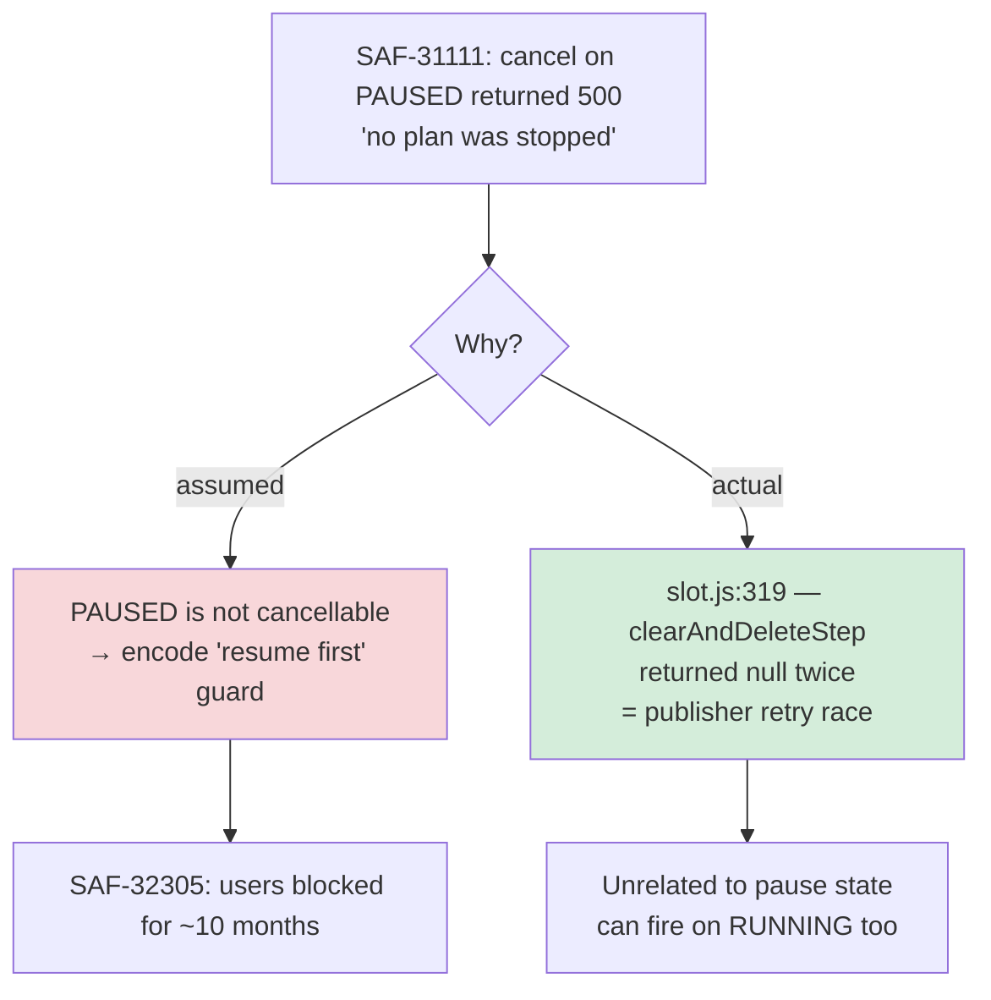
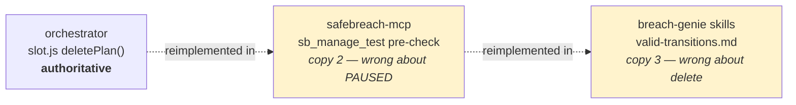

# Cancel a PAUSED Test Directly — SAF-32305

## 1. Overview

`manage_test(action="cancel")` refuses to cancel a `PAUSED` test and instructs the caller to resume
it first. The orchestrator supports the transition explicitly, the UI performs it routinely through
the same endpoint, and a live staging call proves it returns 200. The restriction is a client-side
invention.

**Goal**: remove it, and stop the MCP layer from owning a second copy of the orchestrator's state
machine.

| | |
|---|---|
| Ticket | [SAF-32305](https://safebreach.atlassian.net/browse/SAF-32305) — Bug, Medium, Cloud |
| Introduced by | SAF-31111 |
| Repos | `safebreach-mcp` (Phase 1) · `breach-genie` (Phase 2) |
| Branch | `bugfix/SAF-32305-cancel-paused-test` (off `main`) |
| User impact | HELM users must abandon the agent and use the UI to cancel a paused test |

## 1.5 Document Status

| Field | Value |
|---|---|
| Status | Ready for implementation |
| Prepared | 2026-09-06 |
| Root cause | Confirmed — code-traced across 3 repos, verified live on staging |
| Prior art | `context.md`, `summary.md` in this folder |
| Open decisions | None. AC3 (skill stops pre-refusing) confirmed in scope. |

## 2. Solution Description

Delete the `PAUSED` guard in `sb_manage_test()`. Nothing replaces it — no internal resume-then-cancel,
no retry, no softened warning. `cancel` on a `PAUSED` test issues the same
`DELETE /api/orch/v4/accounts/{acct}/queue/{planRunId}` it issues for a `RUNNING` one.

The idempotent quick-returns (`already_paused`, `already_running`, `already_canceled`,
`already_completed`) stay. They are the good half of SAF-31111's pre-check: they return
success-shaped results rather than refusals, they sit before the rate limiter so they cost nothing,
and they are race-safe on a shared console.

Phase 2 removes the mirrored rulebook in the HELM skills so the tool is the single authority on what
transitions are legal.

### Why the guard was wrong



### The three-copy problem



Each copy drifts independently. Copy 2 was wrong about `PAUSED`; copy 3 is right about `PAUSED` but
has never heard of `delete`. Fixing one row leaves the mechanism. Phase 2 collapses copy 3 into a
pointer at copy 2.

## 3. Core Feature Components

### 3.1 The guard removal

`safebreach_mcp_studio/studio_functions.py:3484-3488` — delete:

```python
if current_state == "PAUSED":
    raise ValueError(
        "Cannot cancel a paused test. Use manage_test with "
        "action='resume' first, then cancel."
    )
```

The surrounding `if action == "cancel":` block keeps its terminal-state quick-return. After removal
the `cancel` branch handles exactly one case: already-terminal → quick-return. Everything else falls
through to the DELETE.

### 3.2 Transition matrix after the change

| Current state | `pause` | `resume` | `cancel` | `delete` |
|---|---|---|---|---|
| `PENDING` | PUT | PUT | DELETE | ✗ not terminal |
| `RUNNING` | PUT | quick-return `already_running` | DELETE | ✗ not terminal |
| `PAUSED` | quick-return `already_paused` | PUT | **DELETE (was: ValueError)** | ✗ not terminal |
| `COMPLETED` | ValueError | ValueError | quick-return `already_completed` | dry-run → DELETE |
| `CANCELED` | ValueError | ValueError | quick-return `already_canceled` | dry-run → DELETE |

Only the bolded cell changes.

### 3.3 Test surface

| File | Line(s) | Change |
|---|---|---|
| `safebreach_mcp_studio/tests/test_studio_functions.py` | 8169-8179 | `test_cancel_on_paused_raises_error` → `test_cancel_on_paused_proceeds`; assert `requests.delete` called, not `pytest.raises` |
| same | new | `test_cancel_on_paused_resolved_from_live_queue_proceeds` — exercises the unmocked queue→state path (rescoped; see test-plan T-2) |
| same | new | `test_cancel_on_paused_propagates_orchestrator_error` — R1: a 500 surfaces as an error, no retry, message does not mention resume |
| `safebreach_mcp_studio/tests/test_rate_limiting.py` | new | `test_cancel_on_paused_consumes_a_rate_limit_slot` — the unblocked path is metered |
| `conftest.py` | 147-159 | drop the resume-then-cancel `except` fallback |
| `tests/test_rate_limiting_e2e.py` | 45-56 | same, incl. the two extra `_rate_limit_store.clear()` calls |

### 3.4 Documentation

- `safebreach_mcp_studio/studio_server.py:1553-1591` — state that a paused test can be cancelled
  directly; document all four actions (`delete` is currently absent from the prose).
- `CLAUDE.md:471-478` — same; entry still reads "pause, resume, cancel" though `delete` shipped in
  SAF-29972.

## 4. API Endpoints and Integration

No API changes. The fix removes a client-side branch; the wire calls are unchanged.

| Action | Call | Unchanged |
|---|---|---|
| `cancel` | `DELETE {orch}/api/orch/v4/accounts/{acct}/queue/{planRunId}` | ✓ |
| `pause`/`resume` | `PUT .../queue/{planRunId}/state` `{"status": action}` | ✓ |
| `delete` | `DELETE {data}/api/data/v1/accounts/{acct}/tests/{testId}` | ✓ |

**State read** — `_get_test_state()` (`studio_functions.py:3096-3130`): orchestrator
`GET /queue` first via `queue_state.get_orchestrator_test_state()`, falling back to the data API
`testsummaries` only when the test is absent from the queue. See R5 for why that fallback matters
here.

## 5. Example Customer Flow

**Before** — user has a paused test, asks HELM to cancel it:

1. HELM reads state → `PAUSED`
2. HELM calls `manage_test(action="cancel")`
3. Tool raises `ValueError("Cannot cancel a paused test...")`
4. HELM relays: *"A paused test needs to be resumed before it can be cancelled. Let me do that now."*
5. HELM calls `manage_test(action="resume")` — a rate-limited mutation, and the single most
   crash-prone call in this API (see R4)
6. HELM calls `manage_test(action="cancel")` — a second rate-limited mutation
7. Two mutations, two rate-limit slots, a needless state change on a live test

**After**:

1. HELM reads state → `PAUSED`
2. HELM calls `manage_test(action="cancel")` → `DELETE .../queue/{planRunId}` → 200
3. HELM re-reads and reports `CANCELED`

One mutation, one rate-limit slot, matching what the UI's "Remove test" already does.

## 6. Non-Functional Requirements

| Requirement | Detail |
|---|---|
| Rate limiting | Unchanged. The fix **reduces** consumption — one action instead of two. Quick-returns remain free (they precede `check_limit` at `:3521`). |
| RBAC | Unchanged; `check_rbac_response` still wraps the DELETE. |
| Backwards compatibility | A caller relying on the `ValueError` would be relying on a bug. No compatibility shim. |
| Error honesty | An orchestrator 500 must reach the user as an orchestrator 500. No retry, no re-interpretation. |
| Audit | `reason` still appends its timestamped note, best-effort, unchanged. |

## 7. Definition of Done

### Phase 1 — safebreach-mcp

- [x] **DoD-1** `manage_test(action="cancel")` on a `PAUSED` test issues the DELETE and succeeds; no resume is planned, attempted, or mentioned in any response field.
- [x] **DoD-2** The guard at `studio_functions.py:3484-3488` is removed outright — not replaced by an internal resume-then-cancel.
- [x] **DoD-3** `test_cancel_on_paused_raises_error` is inverted to assert the DELETE proceeds.
- [x] **DoD-4** A regression test covers cancel on a multi-step plan whose steps are partially paused (R2). *Closed by the e2e `test_e2e_cancel_paused_multistep_test`, not at unit level — see test-plan T-2 reconciliation.*
- [x] **DoD-5** An orchestrator 500 propagates as an honest error — not retried, not re-described as a pause restriction (R1).
- [x] **DoD-6** The resume-then-cancel fallbacks in `conftest.py:147-159` and `tests/test_rate_limiting_e2e.py:45-56` are removed.
- [x] **DoD-7** `studio_server.py` tool description and `CLAUDE.md` state that `PAUSED` → cancel is legal and document all four actions including `delete`.
- [x] **DoD-8** Verified end-to-end against a live paused test on **pentest01** (the console QA filed against), 2026-09-07 — see `test-results/phase-1c.md`.

### Phase 2 — breach-genie

- [ ] **DoD-9** `safebreach-managing-tests` documents `delete`: terminal-states-only, irreversible, `dry_run=True` default with a preview step, `reason` mandatory.
- [ ] **DoD-10** The synonyms table stops routing *"remove from queue"* / *"kill"* to `cancel` where the user means `delete`; the skill title drops "(pause / resume / cancel)".
- [ ] **DoD-11** The skill stops pre-refusing `pause` on `PAUSED` and `resume` on `RUNNING`; it calls the tool and reports the `was_already` response.
- [ ] **DoD-12** `reason` is documented as an argument HELM should pass, and rate-limited responses have defined handling.
- [ ] **DoD-13** The action-legality table, global-pause gate and `N/A`-means-no-permission note each exist in exactly one place.
- [ ] **DoD-14** The two skills are **not** merged; the ticket records why.

## 8. Implementation Phases

### Phase Status Tracking

| Phase | Name | Status | Completed | Commit |
|-------|------|--------|-----------|--------|
| 1a | The fix and its tests | ✅ Complete | 2026-09-07 | `287b361` |
| 1b | Fixture and doc cleanup | ✅ Complete | 2026-09-07 | `780eca3` |
| 1c | Live verification | 🔄 In Progress | — | T-6/T-7 pass; T-8 (manual HELM regression) outstanding |
| 2 | HELM skills (breach-genie) | ⏳ Pending | — | — |

### Phase 1a — the fix and its tests (safebreach-mcp)

1. Invert `test_cancel_on_paused_raises_error` → red.
2. Add `test_cancel_on_partially_paused_multistep_plan` (R2) → red.
3. Add `test_cancel_propagates_orchestrator_500` (R1) → red.
4. Delete the guard → green.
5. Full unit suite. **Gate**: 1676+ passing, zero regressions.

Covers DoD-1..5.

### Phase 1b — fixture and doc cleanup (safebreach-mcp)

1. Strip the resume-then-cancel fallback from `conftest.py` and `tests/test_rate_limiting_e2e.py`.
2. Update `studio_server.py` tool description and `CLAUDE.md` — including the missing `delete`.
3. **Gate**: unit suite green; grep confirms no "resume first" phrasing survives.

Covers DoD-6..7.

### Phase 1c — live verification

1. Queue a scenario on staging, pause it, cancel it via `manage_test` — one call, no resume.
2. Repeat on a multi-step plan paused mid-step.
3. Record results in `test-results/`. **Gate**: DoD-8.

### Phase 2 — HELM skills (breach-genie)

Separate commit, same ticket. Rewrite `safebreach-managing-tests` so it teaches procedure
(verify-before-act, active-queue targeting, honest post-action reporting) and defers legality to the
tool. Add `delete` with its dry-run discipline. Dedupe SKILL.md against its own references. Leave
`safebreach-test-states` untouched.

Covers DoD-9..14.

## 9. Risks and Assumptions

**R1 — the 500 is real, just misattributed.** `no plan was stopped` (`slot.js:319`) can still fire on
a publisher retry race, paused or not. With the guard gone it surfaces as a genuine API error.
*Mitigation*: DoD-5 asserts it propagates untouched. Explicitly **not** retried — SAF-31111's mistake
was treating a flaky backend as a state rule, and a retry here would hide it a second way.

**R2 — merged multi-step status.** A test's status is the merged status of its steps.
`_get_test_state()` reads slot-level `isPaused` (`queue_state.py:53-54`) while `deletePlan` iterates
per-step `pausedDate`. A partially-paused plan must still cancel. *Mitigation*: DoD-4.

**R3 — global pause.** "All Running is Paused" gates individual pause/resume, not cancel — the UI
imposes no cancel gate. *Assumption*: do not add one.

**R4 — the guard pushed HELM toward the most dangerous call in the API.** SAF-32835 (Done) captured
the orchestrator crashing on a resume during repeated cancel attempts:
`TypeError: Cannot read properties of undefined (reading 'type')` at `TestManager.setLocalState:497`
via `setResumeParams:480`. SAF-31111 independently reported "Resuming a canceled test causes a 500
server crash". So the guard's prescribed workaround — resume, then cancel — routed users through a
call with a known crash mode, to work around a restriction that did not exist. This raises the
severity of the fix beyond user annoyance.

**R5 — the data-API fallback can still report a stale `PAUSED`.** SAF-31138 (Done) documented that
`testsummaries` can report `PAUSED` for a test the orchestrator considers running, and it named this
exact consequence: *"MCP `manage_test` tool (SAF-31111) relies on `testsummaries` for state
pre-checks — stale status can lead to incorrect guidance (e.g., 'resume first' when the test is
actually running)."* That is SAF-32305, predicted in May 2026 and filed against the wrong layer.
`_get_test_state` now prefers the orchestrator queue, so the vector is narrowed to tests absent from
the queue — but for those the fallback's `PAUSED` is precisely the stale artifact SAF-31138
described. *Removing the guard eliminates this path entirely*, which is the strongest argument for
deleting rather than correcting it.

**R6 — Phase 2 changes HELM behavior beyond the reported bug.** DoD-11 makes HELM call the tool where
it used to refuse locally. Cost is one round trip; quick-returns consume no rate-limit slot.
*Confirmed in scope by the user, 2026-09-06.*

### Related tickets reviewed (no duplicates)

| Ticket | Status | Relationship |
|---|---|---|
| SAF-31111 | Done | **Introduced the guard.** Premise refuted here. |
| SAF-31138 | Done | Predicted this exact failure mode (R5). |
| SAF-32835 | Done | Orchestrator crash on resume during cancel (R4). |
| SAF-32181 | Done | HELM miscounted paused tests when cancelling by name — adjacent, already fixed. |
| SAF-32249 | Done | 502 on `delete` dry-run preview — confirms `delete` is live and undocumented in the skills. |
| SAF-34457 | Done | `status_filter='paused'` regression — unrelated read path. |

Verdict: **PROCEED**. No duplicate.

## 10. Future Enhancements

- Retire the client-side state pre-check entirely, keeping only the idempotent quick-returns, and let
  the orchestrator be the sole authority. The pre-check's remaining value is friendlier errors on
  terminal states; weigh that against a fourth drift surface.
- Root-cause the `no plan was stopped` retry race in the orchestrator (own ticket).
- Root-cause the intermittent 500 on the `testsummaries` note append (`studio_functions.py:3529-3538`
  already forbids retrying around it).

## 11. Executive Summary

HELM told users a paused test must be resumed before cancelling. It could not — the MCP tool raised
before calling the API. The orchestrator has always supported the transition (a dedicated branch in
`deletePlan` finalises pause duration when a paused plan is deleted), and the UI's "Remove test" uses
the identical endpoint. A live staging DELETE against a paused test returns 200.

The guard came from SAF-31111, which saw a flaky 500 from a publisher retry race and encoded it as a
state rule. It shipped ~10 months ago. SAF-31138 predicted the consequence in May 2026 but was filed
against the data API rather than the MCP.

The fix is a five-line deletion plus tests. The work is the surrounding cleanup: dead fixture
workarounds, docs that never learned about `delete`, and a HELM skill that keeps its own drifting copy
of the transition rules.

## 12. Current Implementation State

**Phases 1a and 1b complete; 1c substantially done (2026-09-07).** The guard is deleted; five tests added/inverted; the dead
resume-then-cancel fixtures are gone and the docs match the tool. Unit suite: **1680 passed,
151 e2e deselected**, zero regressions (baseline was 1676 at `299c2df`).

T-6 and T-7 pass live on pentest01 (139s, `test-results/phase-1c.md`), closing DoD-4 and DoD-8.
T-8 (manual HELM regression) and all of Phase 2 remain outstanding. **DoD-4 is still open** — the multi-step assertion is not
assertable at unit level (the MCP has no step awareness) and rests entirely on T-7 in Phase 1c.

## 13. Change Log

| Date | Change |
|---|---|
| 2026-09-06 | Initial PRD. Root cause confirmed across orchestrator/ui-react/safebreach-mcp and verified live on staging. R4/R5 added after reviewing SAF-32835 and SAF-31138. |
