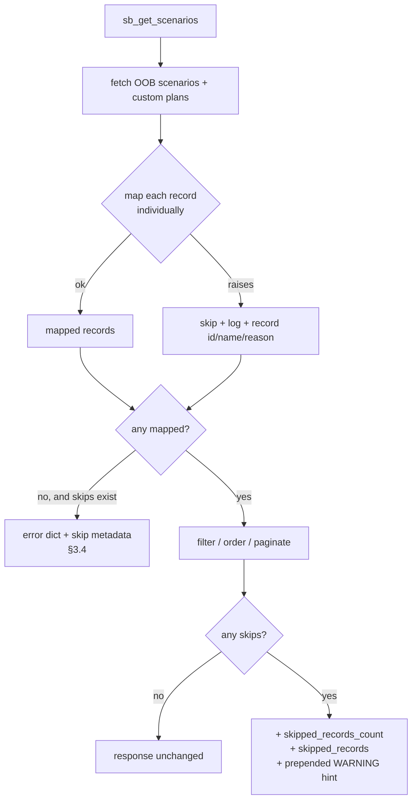

# PRD: SAF-34228 — `get_scenarios` null `steps` crash and per-record resilience

- **Ticket**: [SAF-34228](https://safebreach.atlassian.net/browse/SAF-34228) (Bug, Medium)
- **Branch**: `bugfix/SAF-34228-get-scenarios-null-steps` (off `main` — this repo has no `develop`)
- **Repo**: `SafeBreach/safebreach-mcp`
- **Context**: [context.md](./context.md) | **Ticket content**: [summary.md](./summary.md)

---

## 1. Problem

`dict.get(key, default)` returns `default` only when the key is **absent**; a key present with value
`null` returns `None`. Both scenario/plan mappers compute:

```python
"step_count": len(scenario.get("steps", [])),   # config_types.py:197
"step_count": len(plan.get("steps", [])),       # config_types.py:230
```

so a record with `"steps": null` raises `TypeError: object of type 'NoneType' has no len()`.

`sb_get_scenarios` maps every record inside one `try` (`config_functions.py:620-632`) under a broad
`except Exception` (`:673-678`), so that single record's failure becomes a whole-tool failure:

```json
{"error": "Failed to get scenarios: object of type 'NoneType' has no len()", "console": "default"}
```

2 of 475 records on `staging.sbops.com` trip this, and the other 473 plus all custom plans are
discarded. Deterministic since CI build #1862.

Two defects, both in scope:

| # | Defect | Fix |
|---|--------|-----|
| A | `len()` on a null-valued key | null-safe extraction at the two sites |
| B | One unmappable record fails the whole listing | per-record isolation + surfaced skip count |

B is the one that matters long-term: A is a single record shape, B is the reason any future
unanticipated upstream shape reproduces the same total outage.

## 2. Scope

**In scope** — exactly two changes plus their tests:

1. `config_types.py` — null-safe `step_count` in `get_reduced_scenario_mapping` and
   `get_reduced_plan_mapping`.
2. `config_functions.py` — per-record isolation in `sb_get_scenarios`, with the skipped count surfaced
   in the response and `hint_to_agent`.

**Out of scope** (deliberate — see `context.md` "Out of Scope"): the upstream content-manager write
path; auditing/repairing the staging records (Noam Sagiv, on the ticket); and every other finding from
the investigation audit, including `get_minimal_simulator_mapping` and `run_scenario`'s evaluate path.
Those get their own tickets.

## 3. Solution

### 3.1 Null-safe `step_count` (defect A)

`config_types.py:197` and `:230`:

```python
# before
"step_count": len(scenario.get("steps", [])),
# after
"step_count": len(scenario.get("steps") or []),
```

This is the ticket's suggested fix and matches the repo's existing idiom (`queue_state.py:103`, the
`tags` handling, and `compute_is_ready_to_run` / `_compute_total_attack_count`, which already guard
with `if not steps`). No other line in either mapper needs changing for this record shape — verified:
`_compute_total_attack_count(None)` returns `0` and `compute_is_ready_to_run` returns `False`.

`step_count: 0` is the correct projection of a stepless record regardless of how the data question is
answered upstream.

### 3.2 Per-record isolation (defect B)

Replace the two bulk comprehensions with a helper that isolates each record:

```python
def _map_records_resiliently(records, mapper, kind):
    """Map upstream records one at a time. A record that cannot be mapped is skipped rather than
    failing the whole listing (SAF-34228) — upstream shapes are not under our control."""
    mapped, skipped = [], []
    for record in records:
        try:
            mapped.append(mapper(record))
        except Exception as e:  # noqa: BLE001 - upstream shape is untrusted; never fail the listing
            record_id = record.get('id') if isinstance(record, dict) else None
            record_name = record.get('name') if isinstance(record, dict) else None
            logger.warning("Skipping unmappable %s record id=%s: %s", kind, record_id, e)
            skipped.append({"id": record_id, "name": record_name, "reason": f"{type(e).__name__}: {e}"})
    return mapped, skipped
```

Used at both call sites in `sb_get_scenarios`, accumulating one combined skip list across OOB
scenarios and custom plans.

Note this makes 3.1 belt-and-braces rather than redundant: 3.1 keeps a stepless record **usable**
(it lists correctly with `step_count: 0`), while 3.2 ensures *any* unmappable record — including
shapes not yet seen — costs one row instead of the whole catalog.

### 3.3 Response contract

Additive only. `sb_get_scenarios` post-processes the `paginate_scenarios` result the same way it
already attaches `applied_filters`:

```python
paginated['applied_filters'] = applied_filters
if skipped:
    paginated['skipped_records_count'] = len(skipped)
    paginated['skipped_records'] = skipped[:SKIPPED_SAMPLE_LIMIT]   # cap the sample
    # prepend so the degradation is the first thing the agent reads
    paginated['hint_to_agent'] = ' | '.join(filter(None, [skip_hint, paginated.get('hint_to_agent')]))
```

Where `skip_hint` names the count explicitly, e.g.:

> `WARNING: 2 scenario/plan record(s) could not be read and were SKIPPED (malformed upstream data);
> 473 returned. The listing is incomplete — disclose this to the user. See skipped_records for ids.`

Fields are absent entirely when nothing was skipped, so existing callers and tests are unaffected.

This copies the repo's established never-silently-truncate convention: counted, surfaced top-level,
and named in `hint_to_agent` — as done by `_bulk_result_summary`
(`playbook_functions.py:580-617`), `hidden_no_result_drift_count` (`data_functions.py:2055-2147`),
and `total_capped` (`data_types.py:707-767`).

### 3.4 Total-failure case

If every record fails to map (`mapped == []` and `skipped` non-empty), do **not** report a successful
empty listing — that reads as "this console has no scenarios". Return the existing error-dict shape
with the aggregate reason plus the skip metadata, preserving today's contract for unusable results:

```python
{"error": f"Failed to get scenarios: all {len(skipped)} record(s) were unmappable",
 "console": console, "skipped_records_count": len(skipped), "skipped_records": skipped[:LIMIT]}
```

The broad `except Exception` at `:673-678` stays exactly as-is for genuine global failures (auth,
network, RBAC) — unchanged contract, and the two tests asserting it keep passing.

### 3.5 Flow



## 4. Testing strategy

New unit tests (`safebreach_mcp_config/tests/`):

| # | Test | Asserts |
|---|------|---------|
| T-1 | `get_reduced_scenario_mapping` with `"steps": null` | `step_count == 0`, no raise |
| T-2 | `get_reduced_plan_mapping` with `"steps": null` | `step_count == 0`, no raise |
| T-3 | `steps` key entirely absent (both mappers) | `step_count == 0` — no regression on the old path |
| T-4 | **Regression, exact ticket payload**: `sb_get_scenarios` over a 3-record set where 1 has `"steps": null` | returns the 2 healthy records; no `error` key. Fails before fix, passes after |
| T-5 | Unmappable record that 3.1 does *not* cover (e.g. `categories: null`, still raising in the mapper) | still degrades: healthy records returned, 1 skipped — proves B is independent of A |
| T-6 | Skip metadata | `skipped_records_count == 1`; `skipped_records[0]` carries id/name/reason |
| T-7 | `hint_to_agent` on partial result | contains the count and the word `SKIPPED`; existing hints preserved after it |
| T-8 | Clean listing | `skipped_records_count` / `skipped_records` keys ABSENT; response byte-identical to today |
| T-9 | All records unmappable | error dict per §3.4, not an empty success |
| T-10 | Skip sample cap | with >`SKIPPED_SAMPLE_LIMIT` bad records, `skipped_records` is capped while `skipped_records_count` reports the true total |
| T-11 | Global API failure unchanged | existing `test_api_failure_returns_error_dict` / `test_sb_get_console_simulators_error` still pass |
| T-12 | Cached path | a malformed record cached from a prior call degrades identically on a cache hit |

Regression gate: full suite (`config` + `data` + `utilities` + `playbook` + `core`, `-m "not e2e"`)
must stay green — 1066 tests as of this branch point.

Manual/E2E verification: not reproducible locally (needs a console holding a `steps: null` record).
T-4 encodes the exact reported payload instead. Post-merge, confirm
`Automation-staging-sanity` goes green.

## 5. Phased implementation

### Phase 1 — null-safe `step_count` (defect A)

1. T-1..T-3 written first, failing.
2. Apply the two `or []` edits.
3. **Gate**: T-1..T-3 green; full config suite green.

### Phase 2 — per-record isolation (defect B)

1. T-4..T-12 written first, failing.
2. Add `_map_records_resiliently`, wire both call sites, add response fields + hint, add the
   all-failed branch.
3. **Gate**: T-4..T-12 green; full suite green (1066+); no change to any existing assertion.

### Phase 3 — docs

1. `CLAUDE.md` + `README.md`: document `skipped_records_count` / `skipped_records` on `get_scenarios`.
2. `get_scenarios` MCP tool description in `config_server.py`: one line that the listing may be partial
   and the agent must disclose it — the tool description is what the agent actually reads.
3. **Gate**: user sign-off, then PR.

Each phase is committed separately after sign-off, per the AI-First flow.

## 6. Risks and edge cases

| Risk | Mitigation |
|------|-----------|
| A broad per-record `except` masks real bugs in our own mapper | Every skip is `logger.warning`-ed with id + exception type, and surfaced in the response. Loud, not silent. |
| Log flood if many records are bad | One warning per skipped record is bounded by the fetch size; the aggregate count carries the signal. Revisit only if a console shows mass failure. |
| Unbounded `skipped_records` payload | Capped by `SKIPPED_SAMPLE_LIMIT`; the true total stays in `skipped_records_count`. |
| Agent silently reports a partial catalog as complete | `hint_to_agent` is prepended (read first) and worded as a `WARNING` with an explicit instruction to disclose. |
| Malformed record persists in cache | Caches hold raw payloads, so behavior is identical on hit and miss — covered by T-12. |
| Contract drift for existing callers | New keys are omitted when nothing is skipped (T-8); global-failure path untouched (T-11). |

## 7. Definition of done

- [ ] `step_count` is `0` for `steps: null` in both mappers; no raise
- [ ] `get_scenarios` returns healthy records when some records are unmappable
- [ ] `skipped_records_count` + `skipped_records` present only on partial results
- [ ] `hint_to_agent` names the skipped count and instructs disclosure
- [ ] All-unmappable case returns an explicit error, not an empty success
- [ ] Existing `{"error": ...}` global-failure contract and its tests unchanged
- [ ] T-1..T-12 green; full non-e2e suite green
- [ ] `CLAUDE.md`, `README.md`, and the `get_scenarios` tool description updated
- [ ] Follow-up tickets filed for the out-of-scope audit findings

## 8. Decision log

| Date | Decision |
|------|----------|
| 2026-08-04 | Scope held to the ticket: defects A + B on `get_scenarios` only. An investigation audit surfaced ~40 further null-unsafe expressions and 11 identical structural sites; these were explicitly excluded rather than folded in, and are recorded in `context.md` for separate tickets. |
| 2026-08-04 | Error contract: keep the existing error dict for globally-unusable results; add additive fields for partial results. Rejected migrating these 2 outlier functions to `raise`/`ToolError` — real cleanup, but not this bug's job and it would churn two passing contract tests. |
| 2026-08-04 | Data question (`steps: null` legal?) left with Noam Sagiv and explicitly decoupled: this fix is correct under either answer and must not wait on it. |
