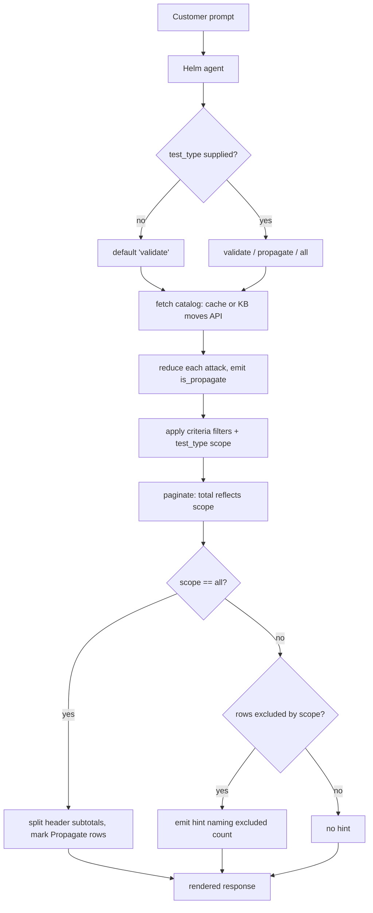

# Disclose Propagate Attacks in Playbook Tools — SAF-34553

## 1. Overview

- **Title**: Disclose Propagate Attacks in Playbook Tools — SAF-34553
- **Task Type**: bug fix
- **Purpose**: Helm's playbook tools return Playbook (Validate) and Propagate/ALM attacks in one
  undisclosed total. Helm states a number that contradicts the Playbook UI beside it, and lists
  attacks by id and name that the customer cannot find, open or run from the Playbook. The data is
  correct; the **scope of the answer** is undisclosed. This fix makes scope explicit and defaults it
  to the catalog the customer is actually looking at.
- **Target Consumer**: Customer (Helm/AI-assistant end users), plus Sales Engineers demoing Helm.
- **Target Roles (RBAC)**: All console roles with Helm access. No role-specific behavior; the fix is
  presentational and filter-level, and introduces no new authorization surface.
- **Key Benefits**:
  1. Helm's attack totals reconcile with the Playbook UI the customer has open beside it.
  2. Propagate attacks are never silently mixed into a Validate answer, and are marked as
     unreachable from the Playbook when they do appear.
  3. Unblocks SAF-34097, a test-automation task explicitly on hold waiting for this fix.
- **Business Alignment**: Helm's value depends on customers trusting its numbers. A total that
  visibly disagrees with the UI beside it undermines the assistant far beyond this one query.
- **Originating Request**: https://safebreach.atlassian.net/browse/SAF-34553 — reported on
  pentest-helm-2156a0.dev.sbops.com, mgmt 26.3.4.

## 1.5 Document Status

| Field | Value |
|-------|-------|
| **PRD Status** | In Progress (awaiting e2e + review) |
| **Last Updated** | 2026-08-19 14:55 |
| **Owner** | Itamar Bar Hod |
| **Current Phase** | All 7 phases complete |

## 2. Solution Description

### Chosen Solution — Approach A: explicit `test_type` parameter, default `validate`

Add a `test_type` parameter (`validate` | `propagate` | `all`, default `validate`) to the playbook
listing tools. Filtering happens inside the MCP, **before** pagination, so the reported total
self-corrects. Propagate rows are marked as unreachable from the Playbook, and a default call that
excluded rows discloses that fact through the existing `hint_to_agent` channel.

Chosen because it is **deterministic**: the agent cannot return mixed data by accident, because the
payload it receives is already scoped. It satisfies all three of the reporter's expected results
literally, and it reuses a parameter name and value vocabulary already established elsewhere in this
repo.

### Alternatives Considered

**B — No parameter; always return both catalogs with split subtotals and labels.**
- *Pros*: smallest diff; no new parameter for the agent to learn; no possibility of hiding data.
- *Cons*: violates expected result 1 (default must be Validate-only). Breaks pagination coherence —
  at `PAGE_SIZE` 10 a page could be entirely Propagate. A careless model can still quote a merged
  total.

**C — Fix it in the Helm system prompt; leave the MCP unchanged.**
- *Pros*: no MCP change, no release.
- *Cons*: **not actually possible.** `transform_reduced_playbook_attack` drops the tag groups, so the
  payload the model receives carries no Propagate marker at all. The model cannot filter or disclose
  what is absent from its input. An MCP data change is required regardless of where presentation
  logic lives.

### Decision Rationale

C is eliminated by a fact rather than a preference. B contradicts an explicit requirement. A is the
only option that satisfies expected results 1–3 without relying on model compliance, and it aligns
with the `safebreach_mcp_data` precedent rather than inventing a second vocabulary for the same
concept.

## 3. Core Feature Components

### Component A: Propagate discriminator (new, `playbook_types.py`)

- **Purpose**: single authoritative answer to "is this attack a Propagate/ALM attack?", derived from
  the raw tag data the API already returns. New helper in an existing module.
- **Key Features**:
  - Reads the raw `tags` array (tag *groups* shaped `{id, name, values:[{value, displayName}]}`).
  - An attack is Propagate when a group has id 44 **and** name `ALM` **and** a value of `1`.
  - Value-aware by design. The ui-react equivalent (`containers/Playbook/moveUtils.ts:190`) checks
    only group presence and ignores the value; that value-blindness is a latent defect and is
    deliberately not ported.
  - Tolerates malformed input (non-list tags, non-dict members, missing `values`) by returning
    `False`, matching the defensive style of the sibling extractors in the same module.
- **Integration points**: consumed by the reduced-attack transform and by the details tool. No
  network calls, no new dependency.
- **Security considerations**: none — reads data already in the process. The tag id is a global
  content constant, not per-account, so it leaks nothing across tenants.

### Component B: Scope filter and payload marker (`playbook_types.py`)

- **Purpose**: expose Propagate identity in the reduced payload and let callers scope the result set.
  Modification to existing functions.
- **Key Features**:
  - The reduced-attack transform always emits an `is_propagate` boolean — one field, the same cost
    basis as the platform fields it already emits unconditionally.
  - The criteria filter gains a `test_type` parameter: `validate` excludes Propagate, `propagate`
    keeps only Propagate, `all` filters nothing.
  - Validation mirrors the established pattern: case-insensitive comparison, and an invalid value
    raises with a message naming the valid values.

### Component C: Orchestration and disclosure (`playbook_functions.py`)

- **Purpose**: thread scope through the listing functions and disclose what the default hid.
  Modification to existing functions.
- **Key Features**:
  - Both listing functions accept `test_type`, defaulting to `validate`.
  - The filter runs **before** pagination, so the reported total reflects the scope. This alone fixes
    the headline number in the bug report.
  - Applied scope is echoed in the applied-filters map so it surfaces in the rendered response.
  - When a `validate`-scoped call excluded at least one attack, a hint is emitted naming the excluded
    count and how to include them. This keeps the default safe *and* discloses the exclusion — the
    ticket's root complaint, inverted.
  - When scope is `all`, the per-catalog counts are computed and returned alongside the total so the
    presentation layer can split the header without recounting.

### Component D: Tool surface and presentation (`playbook_server.py`)

- **Purpose**: expose the parameter to the agent and render scope honestly. Modification to existing
  tool definitions.
- **Key Features**:
  - `test_type` added to the two listing tools' signatures and descriptions. The description carries
    the vocabulary — Propagate/ALM, and that Propagate attacks are not reachable from the Playbook —
    so the model learns the terms once instead of per row.
  - Header total splits into per-catalog subtotals when scope is `all`.
  - Each Propagate row is marked as not reachable from the Playbook.
  - The details tool marks a Propagate attack as unreachable from the Playbook, without altering the
    Propagate-disabled metadata behavior fixed by SAF-33946.

## 4. API Endpoints and Integration

No new APIs. One existing upstream API is consumed, unchanged.

### Existing API consumed

- **API Name**: Knowledge-base moves (attack catalog)
- **URL**: `GET {playbook_base_url}/api/kb/vLatest/moves?details=true`
- **Headers**: `x-apitoken` (resolved by the existing auth layer), `Content-Type: application/json`
- **Source Repository**: `content-manager` (management-side service)
- **Relevant response shape** — each move carries a denormalized `tags` array of tag *groups*:

```
{ "data": [ { "id": 1234, "name": "...", "description": "...",
              "tags": [ { "id": 44, "name": "ALM",
                          "values": [ { "value": "1", "displayName": "1" } ] },
                        { "id": 3, "name": "MITRE_Tactic", "values": [ ... ] } ],
              "content": { ... } } ] }
```

- **Note**: the DB representation differs from the wire representation. In content-manager's `move`
  table, `tags` is an object keyed by tag *name* mapping to an array of value-ids
  (`{"ALM": [1], ...}`); the API denormalizes it against the global `tag` table into the group array
  above. Implementation targets the **wire** shape.

### Consumer surface (MCP tools — this repo's public contract)

| Tool | Change | Backward compatible? |
|------|--------|----------------------|
| `get_playbook_attacks` | new optional `test_type` param; new `is_propagate` field per attack; header/rows re-rendered | Schema: yes (param optional). **Behavior: no — the default result set narrows.** Intentional per expected result 1 |
| `get_playbook_attacks_by_tags` | same | same |
| `get_playbook_attack_details` | Propagate marker added to rendered output | yes |

## 5. Example Customer Flow

### Primary Scenario — the reported defect, fixed

- **Scenario Name**: Customer asks Helm for credential-access attacks while the Playbook is open.
- **Entry Point**: Helm chat panel in the SafeBreach console.
- **Step-by-step Flow**:
  1. Customer types "Show me all attacks related to credential access."
  2. Helm calls the listing tool with a MITRE tactic filter and **no** `test_type` — the default
     `validate` applies.
  3. The MCP filters Propagate out before paginating and returns a Validate-only total.
  4. Helm answers with a number that matches the Playbook header beside it.
  5. Because Propagate attacks were excluded, the response carries a hint naming the excluded count.
     Helm may mention that Propagate attacks exist and can be included on request.
- **Completion State**: the customer sees one consistent number, and every attack Helm names is one
  they can find, open and run from the Playbook.

### Alternative Scenarios

- **Customer asks specifically for Propagate attacks**: Helm passes `propagate`; only Propagate
  attacks are returned, never mixed with Validate.
- **Customer asks for both**: Helm passes `all`; the header splits into per-catalog subtotals and
  every Propagate row is marked as unreachable from the Playbook.
- **Console with no Propagate content**: the Validate result set equals the unfiltered set, no
  attacks are excluded, and no hint is emitted. Verified as the real state of staging-management
  (9,497 moves, zero ALM tags).
- **Invalid scope value**: the tool returns an error naming the valid values, consistent with how the
  sibling module rejects a bad `test_type`.
- **Attack carrying `ALM` with value `0`**: treated as Validate. No such move exists on either
  console inspected, but the value-aware predicate makes the behavior defined rather than accidental.



```mermaid
sequenceDiagram
    participant U as Customer
    participant H as Helm agent
    participant P as playbook MCP server
    participant F as playbook functions
    participant CM as content-manager KB
    U->>H: "attacks related to credential access"
    H->>P: get_playbook_attacks(mitre_tactic_filter=...)
    Note over P: test_type defaults to 'validate'
    P->>F: sb_get_playbook_attacks(..., test_type='validate')
    F->>CM: GET /api/kb/vLatest/moves?details=true (cache miss only)
    CM-->>F: moves incl. tag groups (ALM id 44)
    Note over F: reduce -> is_propagate; scope filter BEFORE paginate
    F-->>P: page + scoped total + excluded count
    P-->>H: Validate-only total + hint about excluded Propagate
    H-->>U: number matching the Playbook UI
```

## 6. Non-Functional Requirements

### Code Reuse

- `safebreach_mcp_data` already implements this concept for **tests**: same parameter name, same
  `validate`/`propagate` vocabulary, same validation style (`data_functions.py:101,119,378-382`;
  `data_types.py:163,172`). Naming, validation shape and error-message form are reused deliberately
  so the two surfaces read as one system.
- The predicate itself is **not** reusable: the sibling tests on `'ALM' in system_tags` for a test
  entity, whereas moves carry tag groups. Only the style transfers.
- The `hint_to_agent` channel already exists in the result contract and is already rendered by the
  server, so disclosure needs no new mechanism.

### Performance Requirements

- No additional network calls. The existing 30-minute, maxsize-5 catalog cache is untouched, and the
  discriminator reads data already in the payload.
- Cost is one boolean per attack plus one predicate evaluation per attack per request, against a
  catalog of roughly 9,600 moves — negligible next to the existing per-attack transform.
- Response token cost is deliberately minimized: the verbose Propagate vocabulary lives in the tool
  description and the hint, not repeated on every row of a 10-row page.

### Technical Constraints

- **Technology Stack**: Python; no new dependencies.
- **Backward Compatibility**: the parameter is optional, so the tool schema stays compatible. The
  *default result set narrows*, which is the intended fix, not an accident — it is called out here
  because any consumer relying on the merged total will see a different number.
- **Deployment**: no feature flag. safebreach-mcp reaches a console only via a version tag that
  `mcp-proxy` pip-installs at docker build time; the release and pin bump are tracked separately
  (SAF-35238 pattern), per the scope decision for this ticket.
- **Forward compatibility**: the reporter notes Propagate attacks will later appear in the Playbook
  behind a "test type" filter. The chosen values match ui-react's existing `testType === 'propagate'`
  so the two surfaces agree when that ships.

### Monitoring & Observability

No new metrics or dashboards. Existing tool-level logging is sufficient; the change alters filtering
and rendering, not operational behavior.

## 7. Definition of Done

**Core Functionality**
- [x] A call with no `test_type` returns Validate attacks only, and the reported total excludes every
      Propagate attack (expected result 1).
- [x] `test_type='propagate'` returns only Propagate attacks, never mixed with Validate
      (expected result 2).
- [x] `test_type='all'` reports a split total (overall plus per-catalog) and marks every Propagate row
      as not reachable from the Playbook (expected result 3).
- [x] A default-scoped call that excluded attacks discloses the excluded count and how to include them.
- [x] The discriminator matches tag group id 44, name `ALM`, value `1`; a value of `0` is treated as
      Validate.
- [x] Scope is applied before pagination — the total reflects the scope, not the unfiltered catalog.
- [x] Applied scope appears in the applied-filters output.
- [x] `get_playbook_attacks_by_tags` honors `test_type` with the same default.
- [x] `get_playbook_attack_details` marks a Propagate attack as not reachable from the Playbook.
- [x] An invalid `test_type` raises an error naming the valid values.

**Quality Gates**
- [ ] Every test in `test-plan.md` for this fix is green, with evidence in `test-results/`.
- [ ] The existing playbook test suite passes unchanged except where the narrowed default is the
      intended change.
- [ ] No regression of SAF-33946: the Propagate-disabled metadata behavior of the details tool is
      unchanged.
- [x] Tool descriptions state the default scope and how to request Propagate or both.

**Deployment Readiness**
- [ ] Verified on a Propagate-capable console (pentest01 has 111 Propagate attacks). Staging cannot
      exercise this path — it has zero Propagate content.
- [ ] Reporter's exact reproduction re-run: Helm's total matches the Playbook UI's Credential Access
      count.
- [ ] Release and `mcp-proxy` pin bump handed to a follow-up ticket, and SAF-34097 notified that its
      blocker has shipped.

## 8. Implementation Phases

| Phase | Status | Completed | Commit SHA | Notes |
|-------|--------|-----------|------------|-------|
| Phase 1: Propagate discriminator | ✅ Complete | 2026-08-19 | 760cf81 | T-1..T-4 green; 262 playbook tests pass |
| Phase 2: Emit `is_propagate` in reduced payload | ✅ Complete | 2026-08-19 | cc27616 | T-5, T-6 green |
| Phase 3: Scope filter in criteria filter | ✅ Complete | 2026-08-19 | cc27616 | T-7..T-10 green |
| Phase 4: Thread scope + disclosure through listing function | ✅ Complete | 2026-08-19 | 5ef1339 | T-11..T-19 green; repro-regression red before fix |
| Phase 5: Tool surface + presentation for `get_playbook_attacks` | ✅ Complete | 2026-08-19 | ca791e8 | T-20..T-23 green; first tests of this layer |
| Phase 6: `get_playbook_attacks_by_tags` parity | ✅ Complete | 2026-08-19 | 2d025c2 | T-25..T-27 green |
| Phase 7: Propagate marker on `get_playbook_attack_details` | ✅ Complete | 2026-08-19 | f661e46 | T-28, T-29 green; T-30 tombstoned |

### Phase 1: Propagate discriminator

- **Semantic Change**: introduce a single predicate that decides whether raw tag data marks an attack
  as Propagate.
- **Deliverables**: module-level constants for the tag id, tag name and the truthy value; a predicate
  taking the raw tags value and returning a boolean.
- **Implementation Details**: The predicate accepts whatever the API put in the `tags` position and
  returns a boolean. Return `False` immediately when the input is not a list. Walk the list; skip any
  member that is not a dictionary. For each member, compare its id against the Propagate tag id and
  its name against the Propagate tag name; both must match. When they do, inspect its values
  collection — if it is not a list, skip the member. Within values, look for any entry whose value
  field equals the truthy marker, comparing as a string so that a numeric or string representation
  both match. Return `True` on the first such match, `False` after exhausting the list. Constants
  carry a comment-free name that makes the ui-react counterpart discoverable via the PRD rather than
  via an inline comment.
- **What can go wrong**: tag ids drifting per console (ruled out — the tag table has no account
  column and id 44 resolves to `ALM` on both consoles inspected); the group present with value `0`
  (handled — treated as Validate); malformed or absent tags (handled — returns `False`).
- **Changes**:

| File | Description |
|------|-------------|
| `safebreach_mcp_playbook/playbook_types.py` | Add Propagate tag constants and the discriminator predicate |

- **Git Commit**: `fix(playbook): add value-aware Propagate attack discriminator`

### Phase 2: Emit `is_propagate` in reduced payload

- **Semantic Change**: every reduced attack carries its catalog identity.
- **Deliverables**: the reduced-attack transform emits a boolean Propagate field unconditionally.
- **Implementation Details**: In the reduced transform, after the existing platform data is merged,
  set a Propagate boolean on the result from the discriminator applied to the raw attack's tags,
  defaulting the lookup to an empty list when the key is absent. Emit it unconditionally, mirroring
  how platform data is always extracted rather than being gated behind an include flag — it is one
  boolean, and both the filter and the renderer depend on it. Do not add it to the field mapping
  table, since it is derived rather than copied.
- **What can go wrong**: an attack with no tags key — handled by defaulting to an empty list.
  Downstream consumers asserting an exact reduced-attack key set will need updating; that is a test
  change, not a behavior change.
- **Changes**:

| File | Description |
|------|-------------|
| `safebreach_mcp_playbook/playbook_types.py` | Reduced transform emits the Propagate boolean |

- **Git Commit**: `fix(playbook): expose is_propagate on reduced playbook attacks`

### Phase 3: Scope filter in criteria filter

- **Semantic Change**: the criteria filter can restrict results to one catalog.
- **Deliverables**: the filter accepts an optional scope and applies it alongside the existing
  criteria.
- **Implementation Details**: Add an optional scope parameter to the criteria filter. When it is
  absent or equals the all-scope value, do not filter. When it equals the Validate value, keep only
  attacks whose Propagate boolean is falsy. When it equals the Propagate value, keep only attacks
  whose Propagate boolean is truthy. Compare case-insensitively, matching the sibling module. Apply
  the scope as one more predicate in the existing filter chain so ordering relative to the other
  criteria is irrelevant to the outcome. Validation of the value itself belongs to the calling
  function (Phase 4), keeping this function a pure filter as it is today.
- **What can go wrong**: an attack missing the Propagate field entirely — treated as falsy, hence
  Validate, which is the safe default given the field is emitted unconditionally in Phase 2.
- **Changes**:

| File | Description |
|------|-------------|
| `safebreach_mcp_playbook/playbook_types.py` | Criteria filter accepts and applies the scope |

- **Git Commit**: `fix(playbook): filter playbook attacks by test type`

### Phase 4: Thread scope + disclosure through listing function

- **Semantic Change**: the listing function scopes results, defaults to Validate, and discloses what
  the default excluded.
- **Deliverables**: scope parameter with a Validate default; validation; scope applied before
  pagination; per-catalog counts when scope is all; a hint when the default excluded rows.
- **Implementation Details**: Add the scope parameter to the listing function with a Validate
  default. Validate it early, alongside the existing page-number check: compare case-insensitively
  against the three permitted values and raise with a message naming them, matching the sibling
  module's message form. Reduce all attacks as today, then compute the Propagate and Validate counts
  from the reduced set *after* the other criteria filters but *before* the scope filter — those two
  numbers are what the split header and the excluded-count hint both need. Pass the scope into the
  criteria filter, then paginate the scoped result, so the reported total reflects the scope. Record
  the scope in the applied-filters map. When the scope is Validate and the Propagate count is
  non-zero, set the agent hint to state how many Propagate attacks were excluded and that the
  all-scope value includes them; preserve any hint the existing code would otherwise have set rather
  than overwriting it. When the scope is all, return the two per-catalog counts so the renderer can
  split the header without recounting.
- **How data flows**: cache or API → reduce (Propagate boolean attached) → criteria filters →
  per-catalog counts → scope filter → paginate → result with scoped total, per-catalog counts, applied
  filters and hint.
- **What can go wrong**: overwriting an existing hint (avoided by composing rather than replacing);
  counting after the scope filter, which would report zero excluded (avoided by ordering); computing
  counts before the other criteria filters, which would report Propagate attacks that the tactic
  filter had already removed and produce a misleading excluded count.
- **Changes**:

| File | Description |
|------|-------------|
| `safebreach_mcp_playbook/playbook_functions.py` | Listing function: scope param, validation, ordered counting, hint |

- **Git Commit**: `fix(playbook): default playbook attacks to validate scope and disclose exclusions`

### Phase 5: Tool surface + presentation for `get_playbook_attacks`

- **Semantic Change**: the agent can request a scope, and the rendered answer states which catalogs it
  covers.
- **Deliverables**: parameter on the tool signature; description covering scope semantics and
  vocabulary; split header when scope is all; per-row Propagate marker.
- **Implementation Details**: Add the scope parameter to the tool function signature with the same
  Validate default and pass it through. Extend the tool description to state the permitted values,
  that the default is Validate-only, that Propagate is also known as ALM, and that Propagate attacks
  are not reachable from the Playbook UI — this is where the vocabulary is taught, once, rather than
  per row. In response assembly, when the scope is all and per-catalog counts are present, render the
  header total as an overall figure followed by the two per-catalog figures; otherwise keep the
  existing single-total line. For each attack, when its Propagate boolean is truthy, append a marker
  line to that attack's rendered block stating it is a Propagate attack not reachable from the
  Playbook. Leave the existing hint rendering untouched — it already prints whatever the function set.
- **What can go wrong**: the marker inflating output on a Propagate-heavy console — bounded, since
  Propagate is roughly one percent of the catalog and pages hold ten rows. A malformed or absent
  count pair must fall back to the single-total line rather than raising.
- **Changes**:

| File | Description |
|------|-------------|
| `safebreach_mcp_playbook/playbook_server.py` | `get_playbook_attacks`: param, description, split header, row marker |

- **Git Commit**: `fix(playbook): expose test_type on get_playbook_attacks and mark propagate rows`

### Phase 6: `get_playbook_attacks_by_tags` parity

- **Semantic Change**: tag-based attack search obeys the same scope rules as the main listing tool.
- **Deliverables**: scope parameter, default and validation on the tag-search function; parameter,
  description and Propagate marker on the corresponding tool.
- **Implementation Details**: Apply the Phase 4 and Phase 5 treatment to the tag-search path. The
  tag-search function reduces attacks with tag inclusion enabled; attach the scope parameter with the
  same Validate default, validate identically, pass the scope into the criteria filter before
  pagination, and set the same excluded-count hint. On the tool side, add the parameter, extend the
  description with the same scope semantics, and mark Propagate rows. The split header applies here
  too when scope is all.
- **Why this phase exists**: without it the same defect remains reachable through a different tool —
  the customer asks about attacks by tag and gets a merged total again.
- **Changes**:

| File | Description |
|------|-------------|
| `safebreach_mcp_playbook/playbook_functions.py` | Tag-search function: scope param, validation, hint |
| `safebreach_mcp_playbook/playbook_server.py` | `get_playbook_attacks_by_tags`: param, description, row marker |

- **Git Commit**: `fix(playbook): honor test_type in get_playbook_attacks_by_tags`

### Phase 7: Propagate marker on `get_playbook_attack_details`

- **Semantic Change**: opening a single attack by id states whether it is reachable from the Playbook.
- **Deliverables**: the details output marks a Propagate attack as not reachable from the Playbook.
- **Implementation Details**: In the details path, evaluate the discriminator against the located
  attack's raw tags and surface the result in the rendered details output as an explicit line stating
  the attack is a Propagate attack and is not reachable from the Playbook UI. Add no scope parameter
  here — the caller supplies a specific id, so filtering would only produce a confusing not-found for
  an attack that demonstrably exists. Leave the Propagate-disabled metadata handling from SAF-33946
  exactly as it is; this phase adds a line to the output and changes no existing branch.
- **Why**: half the reported pain is the customer being handed an id and name they then cannot find,
  open or run. Naming the reason at the point of lookup closes that loop.
- **What can go wrong**: regressing SAF-33946 by restructuring the details response — avoided by
  adding a line rather than reorganizing existing branches.
- **Changes**:

| File | Description |
|------|-------------|
| `safebreach_mcp_playbook/playbook_server.py` | `get_playbook_attack_details`: Propagate reachability marker |

- **Git Commit**: `fix(playbook): mark propagate attacks as unreachable in attack details`

## 9. Risks and Assumptions

### Technical Risks

| Risk | Impact | Mitigation |
|------|--------|------------|
| Narrowing the default result set changes numbers any existing consumer or test asserts | Medium | Intended per expected result 1. Existing playbook tests are reviewed for merged-total assumptions; the change is called out in the tool description so the agent's own framing updates with it |
| Restructuring the details response regresses SAF-33946 (Propagate metadata leak when Propagate disabled) | Medium | Phase 7 adds a line and touches no existing branch; DoD carries an explicit no-regression check |
| The excluded-count hint is computed at the wrong point and reports a misleading number | Medium | Counting order is specified in Phase 4: after the other criteria filters, before the scope filter |
| Overwriting an existing `hint_to_agent` value | Low | Phase 4 composes rather than replaces |
| The 30-minute catalog cache serves pre-change reduced payloads after a deploy | Low | Cache is in-process and dies with the pod; a restart is part of any deploy |

### Assumptions Under Question

| Assumption | Status |
|------------|--------|
| Tag id 44 named `ALM` identifies Propagate on every console | **Validated** — `tag` table has no account column (definitions are global); id 44 resolves to `ALM` on both staging-management and pentest01 |
| Only value `1` is ever set on the ALM group | **Validated on inspected consoles** — pentest01: 111 attacks at value 1, zero at value 0. The predicate is value-aware regardless, so a future value 0 is defined rather than accidental |
| The KB moves API exposes the ALM tag group to this repo | **Validated** — the discriminator's data lives in content-manager's `move.tags`, which is exactly what this endpoint serves |
| Propagate is a small fraction of the catalog, so per-row markers do not bloat responses | **Validated** — 111 of 9,605 on pentest01, about 1.2% |

### Risk Mitigation Strategies

No feature flag: the fix is a correctness change whose entire purpose is that the old behavior stops.
Phases are independently committable, so any single phase can be reverted without unwinding the rest.
Verification happens on a Propagate-capable console before the change is handed to a release.

## 10. Future Enhancements

- **Align with the Playbook UI's "test type" filter when it ships.** The reporter notes Propagate
  attacks will appear in the Playbook behind a test-type filter. Once that exists, the default scope
  here should arguably follow the customer's UI selection rather than being fixed at Validate.
- **Fix the `aks Validate` typo** in `safebreach_mcp_data/data_types.py` (two occurrences).
  Pre-existing and in a different module, so deliberately untouched here.
- **Handle listing truncation at 1000 keys** — unrelated to this fix but noted while reading the
  catalog path.
- **Consider a shared Propagate vocabulary helper** if a third module needs the same
  Validate/Propagate distinction; two implementations is not yet duplication worth abstracting.

## 11. Executive Summary

- **Issue Description**: Helm's playbook tools merged Validate and Propagate attack catalogs into a
  single undisclosed total, so Helm reported a number contradicting the Playbook UI beside it and
  named attacks customers could not find or run.
- **What Was Built**: an explicit `test_type` scope (`validate` | `propagate` | `all`) on the playbook
  listing tools, defaulting to Validate; a value-aware Propagate discriminator; per-catalog subtotals
  and per-row Propagate markers; disclosure of what the default excluded; and a reachability marker
  when a single Propagate attack is opened by id.
- **Key Technical Decisions**: filter inside the MCP before pagination so the total self-corrects,
  rather than relying on the model to disclose scope — the model provably cannot, because the marker
  was absent from its input. Reuse the `test_type` vocabulary already established for tests in
  `safebreach_mcp_data`. Match the tag value rather than merely the tag group, declining to port
  ui-react's value-blind check. Teach the Propagate vocabulary in the tool description rather than on
  every row.
- **Scope Changes**: extended beyond the single tool named in the ticket to the tag-search tool and
  the details tool, since the same defect was reachable through both. Release and `mcp-proxy` pin bump
  deliberately excluded and left to a follow-up ticket.
- **Business Value Delivered**: Helm's attack totals reconcile with the console UI, restoring trust
  in the assistant's numbers well beyond this one query; and SAF-34097 test automation is unblocked.

## 13. Change Log

| Date | Change Description |
|------|-------------------|
| 2026-08-19 13:26 | PRD created — initial draft |
| 2026-08-19 14:05 | Phase 1 complete (760cf81) — discriminator + T-1..T-4 |
| 2026-08-19 14:30 | Phases 2-4 complete (cc27616, 5ef1339) — payload field, scope filter, validate default + disclosure |
| 2026-08-19 14:55 | Phases 5-7 complete (ca791e8, 2d025c2, f661e46) — presentation, by_tags parity, details marker. SAF-33946 DoD item re-scoped; T-30 tombstoned. |

## 12. Current Implementation State

**Progress Summary**
- Last completed phase: Phase 7 — details reachability marker (all 7 phases complete)
- Next phase to implement: none — remaining work is the e2e tests (T-24, T-31, T-32, T-33) against a Propagate-capable console, plus the strict review
- Overall progress: 7 of 7 phases complete

**Blockers**: None

**Files Modified**

| File | Status | Phase |
|------|--------|-------|
| `safebreach_mcp_playbook/playbook_types.py` | Modified | Phase 1 |
| `safebreach_mcp_playbook/tests/test_playbook_types.py` | Modified | Phase 1 |

**Phase Verification Status**

| Phase | Lint | Tests | Code Review | Notes |
|-------|------|-------|-------------|-------|
| Phase 1: Propagate discriminator | N/A | ✅ | ⏳ | No linter configured in repo (pre-commit has only check-added-large-files); 262 passed / 0 failed |

**Notes for Next Session**
- The repo has **no ruff/linter and no unit-test CI** — verification is `uv run pytest safebreach_mcp_playbook/tests/ -m "not e2e"` run locally. Recorded as an accepted gap in `context.md`.
- `_is_propagate_attack` rejects bare-string values (`values: ["1"]`) as malformed; only dict-shaped value objects match. The real API always sends dicts.
- Phase 2 adds `is_propagate` in `transform_reduced_playbook_attack` after the platform merge — do NOT add it to `get_reduced_playbook_attack_mapping`, it is derived, not copied.
