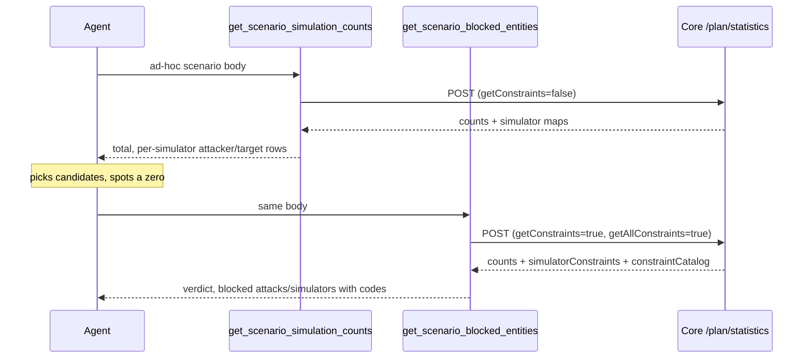

# Scenario Statistics MCP Tools — SAF-35508

## 1. Overview

**Title**: Scenario Statistics MCP Tools — SAF-35508

**Task Type**: feature

**Purpose**
A model assembling a SafeBreach scenario has no way to ask what it would produce before running it. The only route to
impact data was `_get_scenario_statistics`, a private helper reachable solely through `run_scenario` / `quick_run` with
`evaluate=True` — a destructive-hinted tool that queues a real test at `evaluate=False`. It also required a *saved*
`scenario_id` or explicit `attack_ids`, so a configuration still being assembled could not be scored at all. This
delivers two read-only tools over the Core plan-statistics engine that answer the two questions separately: how much a
scenario will produce, and what in it will not run.

**Target Consumer**: Internal — AI agents driving the SafeBreach MCP (Helm and equivalents), and developers/SEs using
the MCP directly.

**Target Roles (RBAC)**: Inherited from the console API token; both tools call the orchestrator through
`check_rbac_response`, so a caller sees only what their role permits. No new role is introduced.

**Key Benefits**
1. A configuration can be scored **before it is saved** — the capability neither `run_scenario` nor `quick_run` offers,
   and the one that actually unblocks assembling a scenario iteratively.
2. Impact data stops being reachable only through a tool declared as running a test.
3. Two live defects in the existing helper are avoided: disconnected simulators counted as runnable, and a `TypeError`
   on limit-reached responses.

**Business Alignment**: CTEM — lets an agent reason about a scenario's real coverage against the live fleet rather than
estimating it, which is a precondition for autonomous scenario construction.

**Originating Request**: JIRA SAF-35508 (subtask of SAF-34615), implementing functional requirements 6 and 7.

---

## 1.5 Document Status

| Field | Value |
|-------|-------|
| **PRD Status** | In Progress |
| **Last Updated** | 2026-09-16 12:27 |
| **Owner** | Boris Berezovsky (implementation by Claude Code) |
| **Current Phase** | Phase 5 of 5 — pending (Phases 1-4 complete, PR #98 open) |

This PRD is **retrospective**: it was written after implementation, from the delivered branch, and every code claim in
it was verified against the repo before being recorded.

---

## 2. Solution Description

**Chosen Solution**
Two separate read-only MCP tools over the same endpoint (`POST /orch/v1/accounts/{accountId}/plan/statistics`), each
answering exactly one question and each fixing its own query parameters internally:

- `get_scenario_simulation_counts` — how many simulations, and which simulators produce them. Requests **no**
  constraints.
- `get_scenario_blocked_entities` — what will not run at all, and why. Requests **every** constraint.

They share their entire input layer, so the two cannot drift on input semantics.

**Alternatives Considered**

| Alternative | Pros | Cons |
|---|---|---|
| **One tool, `evaluate`-style flags** (the ticket's original `checkout_scenario`) | One registration; one call site | The two answers have opposite cost profiles. Constraints cost ~11.8 MB per step and are dead weight to a count. A single tool either always pays or needs a flag that changes the question — the thing the design set out to remove |
| **Extend `_get_scenario_statistics` in place** | Smallest diff | Leaves impact data reachable only via a destructive-hinted tool, and keeps the saved-`scenario_id` requirement that blocks mid-assembly scoring |
| **Vendor a constraint-meaning table in MCP** (ticket AC 7) | Immediate human-readable reasons | `ui-react` has carried an "interim" copy for years and it rotted in both directions. Superseded outright — the API now supplies `constraintCatalog` |

**Decision Rationale**
Splitting by question rather than by flag is what lets each tool fix its parameters, and fixed parameters are what make
each tool's cost predictable. The counts tool makes **zero** playbook requests and discards the `moves` map on arrival;
the blocked tool pays for constraints because they are its entire answer. A single tool could not have both properties.

---

## 3. Core Feature Components

### Component A — Shared input and fetch layer

**Purpose**: New code in `safebreach_mcp_studio/studio_functions.py`, used by both tools so input semantics cannot
diverge.

**Key features**
- Exactly-one-input rule across `scenario` / `scenario_id` / `test_id` (`_sole_scenario_input`). A blank or
  whitespace-only value counts as **absent**, not as a choice; naming none or two raises an error naming all three.
- `_statistics_plan_body` builds the POST body and returns the submitted step count when it is knowable. `scenario` →
  `{name, steps}`; numeric `scenario_id` → `{name, id}`; `test_id` → `{name, testId}`.
- `_plan_id` accepts **numeric plan ids only**. An OOB scenario UUID is refused, and the message routes the caller to
  `get_scenario_details`. This is what keeps every input form at exactly one request.
- `_require_steps` rejects a step-less scenario before a request is spent (the endpoint answers it `400 NOT_ALLOWED`).
- `_fetch_plan_statistics` issues the single POST, 120 s timeout, with two keyword flags (`get_constraints`,
  `get_all_constraints`) both defaulting **off**. Booleans are sent as their JSON spelling — `requests` would serialise
  a Python `True` as `"True"`, which the endpoint reads as a different question.
- `is_computed_count` is the single arbiter of "was this measured" and excludes `bool` deliberately, since `True` is an
  `int` in Python and would otherwise read as the number 1.

### Component B — `get_scenario_simulation_counts`

**Purpose**: Answer how many simulations a scenario produces and which simulators produce them, so a model can choose
attackers and targets.

**Key features**
- Query parameters fixed at `limit=500000`, `includeDisabled=false`, `getConstraints=false`, `getAllConstraints=false`,
  `useCache=true`. Counts are therefore **runnable**; the *expected* figure is neither offered nor derivable, because
  `includeDisabled=true` both counts disabled simulators and suppresses the offline reason.
- Four layers — normalize, shape, project, narrate — of which only the last reaches the model. `moves` is discarded in
  normalize, the earliest point this side controls, which is what makes the tool cost **zero playbook requests**.
- Output is one row per simulator carrying **both** role numbers, ranked by total contribution. A simulator offered in
  only one role says so in the other, which is what marks it a target-only or attacker-only candidate.
- Simulators measured at exactly zero are listed rather than hidden — "produces nothing here" is the most actionable
  statement the answer can make about a machine.
- `simulator_ids` answers named simulators in both roles with one of four dispositions.

### Component C — `get_scenario_blocked_entities`

**Purpose**: Answer what in a scenario will not run and why. Reports only — nothing is removed and save is never
blocked.

**Key features**
- Same three inputs, plus `attack_ids`. **Ran outranks blocked**: an attack scored `0` in one step and 240 in another
  ran, and the answer never depends on step order.
- Query parameters differ in one place that matters: `getConstraints=true` **and** `getAllConstraints=true`.
- **Three states, not two.** A simulator present in the count map at `0` is *blocked*; one **absent** from it —
  offline, disabled or unapproved under `includeDisabled=false` — is reported as *excluded*. Offline nodes are seeded
  into `simulatorConstraints` carrying `simulator_is_offline` but never into `simulators`, so folding the two would
  report every switched-off machine as incompatible.
- An attack that runs on fewer simulators than offered is a **reduction, not a block**, and is not listed.
- A four-state verdict — blocked / clean / partially evaluated / not evaluated — decided by whether counts were
  computed and never by whether the lists are empty.
- Constraint meanings are relayed verbatim from the response's own `constraintCatalog`. No meaning is authored in
  this repo.
- **At the attack cap the answer summarises rather than samples.** Past 50 blocked attacks in a step the per-attack
  list is dropped **whole** and replaced by a tally of blocked attacks per constraint code, so all of them are
  accounted for instead of the first 50. The catalog then covers every code any blocked entity cites, and a caller
  who needs exact per-attack constraints names them in `attack_ids`, which carries the blockers in its answer. This
  is the same rule the counts tool applies to its own listing: a sample answers nobody.

**Component interaction**: The two tools' hints route to each other. Component A is shared by both; B and C have
independent shaping layers because their payloads differ by roughly three orders of magnitude.

---

## 4. API Endpoints and Integration

### Existing API consumed

**API Name**: Core plan statistics (impact and validation engine)

**URL**: `POST {orchestrator}/api/orch/v1/accounts/{account_id}/plan/statistics`

**Headers**: `Content-Type: application/json`, plus console auth headers from
`get_auth_headers_for_console`. RBAC enforced via `check_rbac_response`.

**Query parameters** (fixed per tool, never exposed as tool parameters):

| Parameter | Counts tool | Blocked tool | Effect |
|---|---|---|---|
| `limit` | `500000` | `500000` | Circuit breaker; past it the reply is truncated and null-filled |
| `includeDisabled` | `false` | `false` | Runnable counts; `true` also suppresses `simulator_is_offline` |
| `getConstraints` | `false` | **`true`** | Populates `simulatorConstraints` and `constraintCatalog` |
| `getAllConstraints` | `false` | **`true`** | Every applicable reason rather than the first a validator chain recorded |
| `useCache` | `true` | `true` | Orchestrator may answer from its own cache |

**Request body**: one of `{"name": "", "steps": [...]}`, `{"name": "", "id": <int>}`,
`{"name": "", "testId": "<planRunId>"}`.

**Response** (`data` envelope): `steps[]` each with `simulationCount`, `moves` (attack id → count), `simulators`
(attacker ∪ target), `attackerSimulators`, `targetSimulators`, optional `simulatorConstraints` and `isLimitReached`;
plus a root `constraintCatalog` when constraints were requested.

**Source repository**: `orchestrator` — controller `src/server/controllers/plan_statistics.js`, validation
`src/server/sbGenerator/validators/job_validator.js`, aggregation `src/server/other/StatisticsAggregator.js`.

**Response contract facts that shaped the design** (verified in the orchestrator source):
- Every in-scope move id and node id is **pre-seeded to `0`**, so `== 0` is a sound "runs nowhere" predicate.
- `simulators` is the attacker ∪ target union; a node present on only one side is **undefined** in the other role map,
  never `0`.
- `simulatorConstraints` is **sparse** — empty leaves are pruned, then simulators with no constraints at all — so an
  absent simulator means "evaluated, nothing recorded", not "not evaluated".
- On the circuit-breaker path the controller pushes a sentinel step and **returns early**: `steps` is shorter than the
  plan, `simulationCount` is `null`, every `moves[id]` is `null`, the three simulator maps are `{}`, and
  `simulatorConstraints` is `{}` **without** its two side sub-keys.
- Only `reason` is guaranteed on a constraint leaf; `values`, `expected`, `actual`, `got`, `required`, `schemaErrors`
  and `value` are optional.

**No new APIs are created.**

---

## 5. Example Customer Flow

**Primary scenario — an agent assembles a scenario and chooses simulators**

**Entry point**: An agent holds a draft scenario body that has never been saved.

1. Agent calls `get_scenario_simulation_counts` with the ad-hoc `scenario` body.
2. Tool returns the total and, per step, every simulator with what it would produce **as attacker** and **as target**.
3. Agent sees `sim-b — attacker: 0 - measured, target: 0 - measured` and drops it from its candidate set; it sees
   `win-1 — attacker: 3, target: not in this step` and keeps it as an attacker only.
4. Agent wants to know *why* `sim-b` produces nothing and calls `get_scenario_blocked_entities` on the same body.
5. Tool returns a verdict, the blocked attacks with the codes cited against them, and the blocked simulators grouped by
   code — e.g. `incompatible_os (target) — 1 simulator(s): sim-b (required: WINDOWS; actual: LINUX)`.
6. Agent adjusts the scenario's filters and re-scores. Neither tool caches, so the new numbers are real.

**Completion state**: The agent has an attacker/target selection justified by measured counts, and an explanation for
every machine it excluded — without having queued a test.

**Alternative scenarios**
- **Large fleet**: a step offering more than 20 simulators returns its count without the per-simulator breakdown and
  asks the caller to narrow the step's simulators filter. It deliberately does *not* say "name `simulator_ids`" —
  choosing simulators is how a caller would learn which ids are worth naming, so that instruction closes the loop on
  itself.
- **Evaluation stopped early**: both tools report the reply as truncated/not-computed rather than as zeros. The blocked
  tool's verdict reads `not_evaluated`, explicitly "not a clean result".
- **Offline machine**: appears in neither tool's count output; the blocked tool reports it under *excluded from
  scoring* with `simulator_is_offline`.
- **Error conditions**: naming zero or two inputs, a non-numeric `scenario_id`, a step-less scenario, or a filter that
  names nothing are all refused **before** any request; the tool returns the message as text rather than raising.

---

## 6. Non-Functional Requirements

**Code Reuse**
Both tools share one input layer rather than two copies, so the exactly-one rule, blank-is-absent, the numeric-id
refusal and the step-less rejection exist once. The blocked tool required a parallel shaping layer: the counts tool's
normalizer deliberately drops `moves`, and the pre-existing `_summarize_constraints` keys by move id only and
deduplicates the reason **across simulators**, discarding the simulator id and the attacker/target side — which makes
it unusable for the simulator half of the blocked answer.

**Security & Compliance**
- No secrets handled; auth headers come from the existing console provider chain.
- RBAC enforced per call via `check_rbac_response`; an HTTP failure becomes a typed `ValueError` carrying the status
  and body.
- Both tools are `readOnlyHint=True` and mutate nothing. They are therefore **not** rate-limited — that contract in
  `CLAUDE.md` applies to `readOnlyHint=False` tools only, and the gate table is deliberately not extended.

**Performance Requirements**
- **One HTTP request per call**, for every input form. No input resolves an id by listing the console.
- **Zero playbook requests.** Resolving even one attack name costs the whole playbook (`?details=true`) — there is no
  per-id endpoint — so neither tool resolves names; entities are reported as ids.
- Constraint data is the dominant cost: one ordinary step measured **38,531 conflicts / 11.8 MB** at
  `getAllConstraints=false`, and `true` is strictly larger. Because read-only tools get no rate-limit cover, the caps
  and the per-code grouping are the **only** cost control.
- Measured output sizes: a 500-node fleet renders **683 characters** with the breakdown dropped, against ~44,500 if
  every simulator were listed.

**Technical Constraints**
- Python 3.12+; `requests`; no new dependencies.
- Depends on orchestrator `e2c69b25f` (SAF-35568) for `constraintCatalog`. That commit is on `develop`, which is not
  necessarily the deployed build, so the catalog is treated as **optional** throughout.
- Backward compatible: purely additive. `_fetch_plan_statistics` gained two keyword flags, both defaulting off.

**Monitoring & Observability**
One INFO log per call naming the console. No new metrics or dashboards.

---

## 7. Definition of Done

**Core Functionality**
- [x] Both tools accept an ad-hoc plan body with no saved scenario, and a saved plan id passed through as `{id}`.
- [x] A scenario with no steps surfaces a typed error rather than an unhandled 400.
- [x] Counts tool surfaces per-step `simulationCount` and per-simulator attacker/target counts.
- [x] Counts are runnable; documentation states the expected figure cannot be derived from a runnable response.
- [x] `isLimitReached` is reported explicitly; `null` (not computed) is never rendered as `0`; a reply shorter than the
      submitted plan is reported as early termination.
- [x] Blocked tool reports attacks at `moves[id] == 0` and simulators at `simulators[id] == 0`, read from the
      attacker ∪ target union map, each carrying its blocking constraints.
- [x] Simulators absent from scoring are reported as a distinct *excluded* category, never as blocked.
- [x] Reporting blocks does not mutate the scenario or prevent saving.
- [x] No constraint meaning is authored in this repo; `constraintCatalog` is relayed verbatim and an absent catalog is
      disclosed as such.
- [x] Both tools are registered with `readOnlyHint=True` and documented in the `CLAUDE.md` tool catalog.
- [x] The rate-limiting gate table is **not** extended.
- [x] No caching MCP-side, so no stale impact number can be served.
- [ ] At the attack cap no partial attack list is returned; the verdict, a per-code tally covering every blocked
      attack, the simulator sections and the catalog are returned instead (Phase 5).
- [ ] The constraint catalog at the cap covers every code any blocked entity cites, collected before capping (Phase 5).
- [ ] A named `attack_id` carries its blockers in both cap states (Phase 5).

**Quality Gates**
- [x] Studio suite green — 562 passed / 37 skipped (80 tests across the two tools).
- [x] `ruff --select F` clean on all changed files.
- [x] Mutation check: introducing the forbidden "verdict from list emptiness" bug is caught by two tests.
- [x] `CLAUDE.md` and `CHANGELOG.md` updated.
- [ ] **`test-plan.md` not authored** — see §9. The DoD's normal wording ("every test in `test-plan.md` is green, with
      evidence in `test-results/`") cannot be satisfied; tests live only in the two suite files.
- [ ] Code review — PR #98 open.
- [ ] Verified against a live console (no console reachable from the implementation environment).

**Deployment Readiness**
- [x] Purely additive; no migration, no feature flag, no rollback procedure needed.
- [x] Backward compatible — shared helper defaults preserve the counts tool's existing request exactly.

---

## 8. Implementation Phases

| Phase | Status | Completed | Commit SHA | Notes |
|-------|--------|-----------|------------|-------|
| Phase 1: Counts tool over plan/statistics | ✅ Complete | 2026-09-15 | `62a8559` | 579 insertions, 0 deletions |
| Phase 2: Narrow `scenario_id` to numeric plan ids | ✅ Complete | 2026-09-15 | `199ea27` | Makes every input form one request |
| Phase 3: Pair each simulator's attacker/target numbers | ✅ Complete | 2026-09-15 | `3b0a5fc` | Replaces two per-role lists |
| Phase 4: Blocked-entities tool | ✅ Complete | 2026-09-16 | `7dc0fe6` | 1,047 insertions |
| Phase 5: Summarise by reason at the attack cap | ⏳ Pending | - | - | Supersedes the cap behaviour shipped in Phase 4 |

### Phase 1 — Counts tool over plan/statistics

**Semantic change**: Expose the plan-statistics endpoint as a registered read-only tool that accepts an unsaved plan
body.

**Deliverables**: Input layer, fetch, four shaping layers, narrator, registration, tests, docs.

**Implementation details**: Resolve which of the three inputs was named and build the POST body from it. Issue one
request with all query parameters fixed. Preserve every count exactly, deciding once whether each was measured. Discard
the attack map on arrival. Derive per-step totals and coverage, guarding both the total (summing nothing must not
assert zero) and any truncation claim (only makeable when this side holds the step list). Render markdown.

**Changes**

| File | Description |
|---|---|
| `safebreach_mcp_studio/studio_functions.py` | Input layer, fetch, normalize/shape/project, `sb_get_scenario_simulation_counts` |
| `safebreach_mcp_studio/studio_server.py` | Registration and narrator |
| `safebreach_mcp_studio/tests/test_scenario_simulation_counts.py` | New suite |
| `CLAUDE.md`, `CHANGELOG.md` | Catalog item 25; Unreleased/Added |

**Verification**: `pytest safebreach_mcp_studio/tests` (the repo has no lint script covering Python; `ruff --select F`
used as the equivalent gate).

**Git commit**: `feat(SAF-35508): get_scenario_simulation_counts scores a scenario without running it`

### Phase 2 — Narrow `scenario_id` to numeric plan ids

**Semantic change**: Refuse a non-numeric `scenario_id` instead of resolving it by listing the console.

**Implementation details**: Extract the id check into its own helper. A digits-only value becomes `{id}`; anything else
raises with a message naming the way through (`get_scenario_details`, then pass the steps as `scenario`). This removes
the only path that ever issued a second request, so `_statistics_plan_body` no longer needs `console`.

**Changes**: `studio_functions.py` (helper + caller), `studio_server.py` (tool description), tests, docs.

**Verification**: suite green; a new test asserts no input form calls `_fetch_all_scenarios` / `_fetch_all_plans`.

**Git commit**: `refactor(SAF-35508): scenario_id takes a numeric plan id only`

### Phase 3 — Pair each simulator's attacker and target numbers

**Semantic change**: Replace two per-role contributor lists with one row per simulator carrying both role numbers.

**Implementation details**: Build the row set from the **union** of both role maps, resolving each simulator's
disposition per role through the same vocabulary the named-id filter uses. Rank by total contribution. Key the listing
cap on the union size, since that is the breakdown's actual length. Past the cap, drop the breakdown whole and ask for
a narrower simulators filter.

**Changes**: `studio_functions.py` (shape/project, `_simulator_rows`), `studio_server.py` (narrator), tests, docs.

**Verification**: suite green; tests pin the union trigger and the measured-zero row.

**Git commit**: `feat(SAF-35508): the breakdown pairs each simulator's attacker and target numbers`

### Phase 4 — Blocked-entities tool

**Semantic change**: Add a second read-only tool answering what will not run, and why.

**Implementation details**: Add two keyword flags to the shared fetch, defaulting off. Normalize keeping `moves`,
`simulators` and `simulatorConstraints`, plus the root catalog as-is (`None` and `{}` are different facts). Walk the
constraint structure **once**, accumulating per-attack and per-simulator groupings in the same pass. Classify
simulators three ways. Compute the verdict first, over the unfiltered report, from whether counts were computed.
Derive the zero-impact lists from the full grouping and cap only afterwards, pinning named ids ahead of every cap.
Narrow the catalog to cited codes. Render verdict first.

**Changes**

| File | Description |
|---|---|
| `safebreach_mcp_studio/studio_functions.py` | Constraint flags, normalize/shape/classify/project, `sb_get_scenario_blocked_entities` |
| `safebreach_mcp_studio/studio_server.py` | Registration and narrator |
| `safebreach_mcp_studio/tests/test_scenario_blocked_entities.py` | New suite |
| `CLAUDE.md`, `CHANGELOG.md` | Catalog item 26; Unreleased/Added |

**Verification**: suite green (562); `ruff --select F` clean; mutation check on the verdict; cross-render of both
tools against one payload with agreement assertions.

**Git commit**: `feat(SAF-35508): get_scenario_blocked_entities answers what will not run, and why`

### Phase 5 — At the attack cap, summarise by reason instead of sampling attacks

**Semantic change**: Past 50 blocked attacks in a step, replace the truncated per-attack list with an exact tally of
blocked attacks per constraint code.

**Why**: Phase 4 shipped a `50 of 60` sample. That contradicts the rule the counts tool already follows and states in
its own output — a sample answers nobody — and it is the weaker half of the trade: fifty near-identical lines cost
~8,500 characters while leaving ten attacks unaccounted for, and they bury the fact a tally makes obvious (on the
measured fixture, one offline machine was implicated in **all sixty**). Summarising is both smaller and more complete.

**Deliverables**: A cap branch that reports every blocked attack by reason, a catalog widened to match, blockers on
named-attack answers, and a hint that routes to `attack_ids`.

**Implementation details**
- In the projection's cap branch, stop truncating the blocked-attack list. Instead walk the step's per-attack
  constraint grouping and accumulate, per code, how many **blocked** attacks cite it and which sides it was recorded
  against. Emit that tally in place of the list; the list key is **absent**, not empty, matching the counts tool's rule
  that an empty list would read as "looked and found nothing".
- **Carry no validator detail on tally rows.** A row stands for many attacks, and the detail fields belong to whichever
  leaf happened to be first — thirty attacks failing `incompatible_os` need not share one `required`/`actual` pair, and
  showing one pair would misrepresent the rest. Detail stays on the per-attack lines below the cap, where it is exact.
- Collect the cited codes **before** capping rather than from the rendered rows, so the catalog covers every code any
  blocked entity cites. Without this the catalog shrinks as the list is dropped, exactly when it is doing the most work.
- Add blockers to a named attack's answer, so `attack_ids` remains the way to get exact per-attack constraints once the
  list is gone. This **supersedes** the Phase 4 mechanism that pinned named ids ahead of the cap — the pinning is
  removed, because the list no longer exists to be pinned into.
- Leave the blocked-simulator and excluded-simulator sections untouched: they are already grouped per code and
  uncapped, so sixty nodes is still a few lines.
- Ordering: tally rows by attack count descending, then code, matching every other grouped list in these two tools.

**What can go wrong**: a step whose sixty attacks all cite one code collapses to a single row. That is correct and
still complete — the verdict carries the exact count — but it is thin, and it is the case where naming `attack_ids`
matters most. The hint says so.

**Changes**

| File | Description |
|---|---|
| `safebreach_mcp_studio/studio_functions.py` | Cap branch emits a per-code tally; cited codes collected pre-cap; named-attack answers gain blockers; pinning removed |
| `safebreach_mcp_studio/studio_server.py` | Narrator renders the tally and the cap hint |
| `safebreach_mcp_studio/tests/test_scenario_blocked_entities.py` | Cap-behaviour tests updated — the existing ones assert the superseded sample |
| `CLAUDE.md`, `CHANGELOG.md` | Catalog item 26 cap paragraph; Unreleased/Added |

**Verification**: `SKIP_E2E_TESTS=true uv run --python 3.12 pytest safebreach_mcp_studio/tests` and
`uvx ruff check --select F` on the changed files. The repo has no Python lint script, so `ruff --select F` is the gate
that actually inspects these files.

**Git commit**: `feat(SAF-35508): at the attack cap, report blocked attacks by reason rather than a sample`

---

## 9. Risks and Assumptions

**Technical Risks**

| Risk | Impact | Mitigation |
|---|---|---|
| `constraintCatalog` absent on the deployed console (orchestrator `e2c69b25f` is on `develop`, not necessarily released) | Medium | Treated as optional end to end; an absent catalog renders bare codes with an explicit "no descriptions supplied" note rather than failing or inventing meanings |
| `getAllConstraints=true` payload size on a large estate | Medium | Caps and per-code grouping are the cost control; the tool's description warns it is the expensive call. **Not yet measured at `true` against a real console** |
| Shared `_fetch_plan_statistics` now serves two tools | Low | Both flags default off; a test asserts the counts tool's exact params are unmoved |
| Reason codes are a moving vocabulary (97 today, was ~102 before `e2c69b25f`) | Low | Nothing is keyed on the vocabulary — an unrecognised code is reported with whatever the catalog says, or nothing |

| Phase 5's tally is only as informative as the code variety | Low | A step where every blocked attack cites one code renders one row. Complete and exact, but thin; the hint routes to `attack_ids` for that case |

**Assumptions Under Question**
- **No test plan exists.** `test-plan.md` was never authored for this feature; tests were written alongside the code.
  The repo convention treats `test-plan.md` as the single source of truth for tests, so §7's normal quality gate cannot
  be satisfied as written. This is a known, deliberate gap, not an oversight to be papered over.
- **No live-console verification.** Every result in this PRD comes from unit tests against canned payloads and from
  reading the orchestrator source. Numbers have not been compared against the console's Checkout tab for the same
  configuration.
- The 38,531-conflict / 11.8 MB figure is inherited from the ticket's own measurement, not re-measured here.

**Risk Mitigation Strategies**: No feature flag — both tools are additive and read-only, so the rollback is removing
the registrations. The pre-existing `_get_scenario_statistics` path is untouched, so `run_scenario` / `quick_run`
behaviour is unchanged.

---

## 10. Future Enhancements

- **Name enrichment.** Attacks and simulators are reported as ids. A per-id playbook lookup does not exist — resolving
  one name costs the whole catalog — so names would need either a new Core endpoint or acceptance of the bulk fetch.
- **Reductions and fail-rate conflicts** (SAF-35484): entities that run on fewer simulators than offered, with a
  swap-or-proceed choice. Explicitly out of scope here.
- **Migrating `_get_scenario_statistics`** and its two callers onto the new path (ticket AC 6). Not done: they consume
  constraint *summaries* that this tool deliberately shapes differently.
- **Expected-vs-runnable in one answer**: currently impossible from one call. Would require two calls, labelled.
- **`test-plan.md` and `test-results/`** authored retrospectively to close the §7 gate.

---

## 11. Executive Summary

**Issue/Feature Description**
An agent building a SafeBreach scenario could not ask what it would produce without queueing a test through a
destructive-hinted tool, and could not score a configuration at all until it was saved.

**What Was Built**
Two read-only MCP tools over the Core plan-statistics engine. `get_scenario_simulation_counts` answers how many
simulations a scenario produces and which simulators produce them, pairing each machine's attacker and target numbers
so a role choice can be made from one row. `get_scenario_blocked_entities` answers what will not run and why, reporting
blocked attacks and simulators with the constraints cited against them. Both accept an unsaved plan body.

**Key Technical Decisions**
1. **Two tools, not one flag.** The two answers have opposite cost profiles; fixed parameters per tool are what make
   each one's cost predictable.
2. **`null` is never `0`.** A single arbiter decides whether a count was measured, and it excludes `bool` deliberately.
3. **Blocked is three-state.** Present-and-zero is blocked; absent is excluded. Conflating them would report every
   offline machine as incompatible.
4. **Caps drop whole, never sample.** A sample answers nobody — a caller reading "20 of 498" cannot tell whether their
   machine is among the 478 unshown. Phase 5 extends this to the blocked tool, which shipped a `50 of 60` sample in
   Phase 4: past the cap it reports every blocked attack **by reason** instead of listing the first fifty.
5. **Meanings are relayed, never authored**, now that the API supplies `constraintCatalog`.

**Scope Changes**
- Tool name changed from the parent ticket's `checkout_scenario` — the input is no longer scenario-only.
- `scenario_id` narrowed to numeric plan ids (ticket AC 1 allowed a UUID), bought in exchange for one request per call.
- Ticket AC 7's vendored `fix_lever` map **dropped** — superseded by `constraintCatalog`.
- Ticket AC 6 (migrating the legacy helper) **not done** — deferred with a stated reason.
- `getAllConstraints=true`, against the ticket's note, because `false` records only whichever reason a validator chain
  happened to hit first.
- **Phase 5 supersedes Phase 4's cap behaviour** — the per-attack sample and the named-id pinning that went with it are
  replaced by a per-code tally plus blockers on named-attack answers.

**Business Value Delivered**
A configuration can be scored before it exists as a saved scenario, which is the precondition for an agent assembling
one iteratively. Impact data is no longer reachable only through a tool that can queue a real test. Two live defects in
the existing helper — disconnected simulators counted as runnable, and a `TypeError` on limit-reached responses — are
avoided by construction.

---

## 12. Current Implementation State

**Progress Summary**
- **Last completed phase**: Phase 4 — Blocked-entities tool
- **Next phase to implement**: Phase 5 — At the attack cap, summarise by reason instead of sampling attacks
- **Overall progress**: 4 of 5 phases complete

**Blockers**: None blocking implementation. PR #98 is open and awaiting review.

**Files Modified**

| File | Status | Phase |
|---|---|---|
| `safebreach_mcp_studio/studio_functions.py` | Modified | 1, 2, 3, 4 |
| `safebreach_mcp_studio/studio_server.py` | Modified | 1, 2, 3, 4 |
| `safebreach_mcp_studio/tests/test_scenario_simulation_counts.py` | Created | 1, 2, 3 |
| `safebreach_mcp_studio/tests/test_scenario_blocked_entities.py` | Created | 4 |
| `CLAUDE.md` | Modified | 1, 2, 3, 4 |
| `CHANGELOG.md` | Modified | 1, 2, 3, 4 |

**Phase Verification Status**

| Phase | Lint | Tests | Code Review | Notes |
|---|---|---|---|---|
| Phase 1: Counts tool | ✅ | ✅ | ⏳ | 41 tests; suite 519 |
| Phase 2: Numeric `scenario_id` | ✅ | ✅ | ⏳ | 41 tests; suite 519 |
| Phase 3: Paired role breakdown | ✅ | ✅ | ⏳ | 44 tests; suite 522 |
| Phase 4: Blocked entities | ✅ | ✅ | ⏳ | 40 tests; suite 562 |
| Phase 5: Summarise at the cap | ⏳ | ⏳ | ⏳ | Not started |

Lint = `ruff --select F` on the changed files; the repo has no Python lint script, so this is the gate that actually
inspects them. Tests = the two suite files, since no `test-results/` exists.

**Notes for Next Session**
- Both tools are on `feature/SAF-35508-scenario-simulation-counts`, PR #98 → `main`.
- **PR #98's description is stale**: it is the first commit's message and still claims an OOB UUID "costs the one
  lookup", which Phase 2 removed, and cites 579 insertions / 519 tests against a four-commit branch.
- The environment could not reach a live console; nothing here is verified against real data.
- An abandoned earlier branch, `feature/SAF-35508-plan-statistics-mcp-tool`, holds a different 15-phase design and its
  own PRD. It is superseded and should be ignored.
- A standalone interactive explainer for the counts tool lives outside the repo at
  `~/playgrounds/scenario-simulation-counts.html`.

---

## 13. Change Log

| Date | Change Description |
|------|-------------------|
| 2026-09-16 11:46 | PRD created — initial draft (retrospective; all 4 phases already delivered) |
| 2026-09-16 12:27 | Appended Phase 5 — at the attack cap, report blocked attacks by reason rather than a 50-of-60 sample. Updated §1.5, §3 Component C, §7 (3 new criteria), §9, §11, §12. Phases 1-4 untouched |
