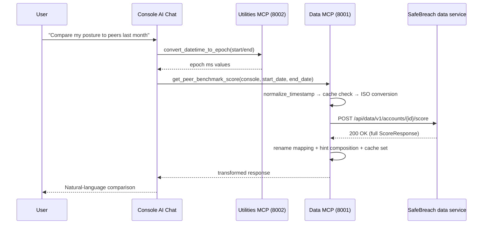

# Peer Benchmark Score MCP Tool — SAF-29415

## 1. Overview

| Field | Value |
|---|---|
| **Title** | Peer Benchmark Score MCP Tool — SAF-29415 |
| **Task Type** | Feature |
| **Purpose** | Expose SafeBreach's Peer Benchmark Score API through the Data MCP server so MCP clients (Claude Desktop, the console AI chat) can answer natural-language posture-comparison questions without users having to open the UI. |
| **Target Consumer** | Internal: SafeBreach console AI-chat users and developer/SE users of Claude Desktop MCP integration. Customer-facing indirectly: end customers querying their own account's benchmark through the AI chat. |
| **Target Roles (RBAC)** | Any role permitted to call `/api/data/v1/accounts/{id}/score` on the backend — this endpoint has **no endpoint-level RBAC gate** beyond the standard signed-request account auth, so all users in an account can call it (both `viewer` and higher). |
| **Key Benefits** | (1) Natural-language posture comparison without UI context switch. (2) Parity between the MCP experience and the backend API/UI output. (3) Makes peer benchmark data available to AI-driven workflows (reports, comparative narratives). |
| **Business Alignment** | Matches SafeBreach's MCP strategy of progressively exposing BAS capabilities to AI agents; completes the data-platform surface for posture analytics. |
| **Originating Request** | [SAF-29415](https://safebreach.atlassian.net/browse/SAF-29415); upstream API delivered in SAF-27621. |

---

## 1.5 Document Status

| Field | Value |
|---|---|
| **PRD Status** | Draft |
| **Last Updated** | 2026-04-13 14:30 |
| **Owner** | Yossi Attas (with AI assistance) |
| **Current Phase** | N/A (not yet in implementation) |

---

## 2. Solution Description

### Chosen Solution

Add a single new MCP tool, `get_peer_benchmark_score`, to the Data Server (port 8001). The tool wraps the existing backend endpoint `POST /api/data/v1/accounts/{account_id}/score` following the established Data-server layering:

- **`data_types.py`** gains a rename-mapping dictionary and a transform helper that renames the API's camelCase keys to self-explanatory snake_case keys while preserving every semantic value. No score re-computation; no field is dropped.
- **`data_functions.py`** gains `sb_get_peer_benchmark_score(...)` which validates inputs, checks a new `peer_benchmark_cache` (`SafeBreachCache`, gated by `SB_MCP_CACHE_DATA`), builds the POST body with ISO 8601 UTC dates, calls the backend with `x-apitoken` auth, handles HTTP 204 explicitly, composes a `hint_to_agent` when scores are null/empty, transforms the payload, and caches the result.
- **`data_server.py`** registers the MCP tool with the same docstring/typing style used by `get_tests_history_tool` and normalizes date inputs via `normalize_timestamp()` before delegating.
- **Tests** cover the happy path, include-only / exclude-only / both-invalid filters, HTTP 204, null `customerScore` / `peerScore`, and backend 500 error. One E2E smoke test is added.
- **Docs** in `CLAUDE.md` are updated (Data Server tools list, Caching Strategy section).

### Alternatives Considered

**Alternative A — Strict pass-through (verbatim camelCase)**
- Pros: zero translation code; precisely matches API/UI output field names.
- Cons: field names like `customAttackIdsFiltered` and `securityControlCategory` (an array, not a category) are misleading for an LLM consumer. Violates the convention already established by `reduced_test_summary_mapping` at `data_types.py:13-20`.
- **Rejected**: the parity NFR is about semantic content, not raw field names.

**Alternative B — Aggressive reduction (drop raw, compute summaries)**
- Pros: very compact response; LLM can answer in one step.
- Cons: loses the category breakdowns that make peer benchmark useful; violates the "support both summarized and raw" bullet in the ticket description; risk of score drift vs UI.
- **Rejected**.

**Alternative C — Python `list[str]` for `include_test_ids` / `exclude_test_ids`**
- Pros: no comma-splitting code.
- Cons: no other Data-MCP multi-value filter uses a list; breaks convention; cross-transport behavior is inconsistent.
- **Rejected**.

**Alternative D — Skip caching (every call hits the backend)**
- Pros: always fresh.
- Cons: diverges from every other Data MCP tool; an agent iterating on wording re-hits the backend.
- **Rejected** — peer data updates daily (ETL), 600s TTL is a non-issue.

### Decision Rationale

The chosen solution is the minimum-deviation-from-convention approach. Every decision was made to keep this tool indistinguishable in style from the other Data MCP tools — same layering, same cache pattern, same auth header, same filter-param style, same test conventions. The only new element is explicit HTTP 204 handling and a hint-composition helper, both of which are unavoidable given backend behavior documented in `/Users/yossiattas/projects/data`.

---

## 3. Core Feature Components

### Component A — Rename + Transform Layer (data_types.py, new)

**Purpose** (new code): translates the backend's camelCase response into a self-explanatory snake_case shape without changing values. Callers of `sb_get_peer_benchmark_score` never see backend field names directly.

**Key Features**:
- A module-level `peer_benchmark_rename_mapping` dict maps every backend key to its MCP-facing key (see Section 4 for the full mapping).
- A helper `get_reduced_peer_benchmark_response(backend_json, hint=None)` walks the payload, applies the rename mapping at each nested level (top-level → ScoreBreakdown → ControlScore), and returns the transformed dict. If `hint` is provided it's attached at the top as `hint_to_agent`.
- Handles the edge cases recorded in the context: `customer_score` / `all_peers_score` / `peer_data_through_date` can be `None`; `industry_scores` can be `[]`; `score_unblocked` may be absent inside peer/industry control entries.

### Component B — Business Logic (data_functions.py, new function + new cache)

**Purpose** (new code): orchestrates validation, caching, HTTP call, 204 handling, hint composition, and transformation.

**Key Features**:
- New module-level cache `peer_benchmark_cache = SafeBreachCache(name="peer_benchmark", maxsize=3, ttl=600)` declared alongside the existing caches.
- `sb_get_peer_benchmark_score(console, start_date, end_date, include_test_ids_filter=None, exclude_test_ids_filter=None)`:
  1. Parses the comma-separated filter strings (strip, drop empties).
  2. Validates mutual exclusivity — raises `ValueError` when both filter lists are non-empty.
  3. Computes a cache key from console + epoch-ms dates + sorted filter lists; returns cached value if present and caching is enabled.
  4. Converts epoch-ms dates back to ISO 8601 UTC `Z`-suffixed strings via `convert_epoch_to_datetime()`.
  5. Builds request body with camelCase keys; only includes `includeTestIds` / `excludeTestIds` when the corresponding list is non-empty.
  6. Sends `requests.post(url, headers={"x-apitoken": ..., "Content-Type": "application/json"}, json=body, timeout=120)`.
  7. If response is HTTP 204 → returns the empty-shape result plus a "no executions" hint.
  8. Otherwise `response.raise_for_status()`; parses JSON.
  9. Composes `hint_to_agent` based on nullity of `customerScore` / `peerScore` / `industryScores`.
  10. Runs the transform helper (Component A), caches, returns.
- Follows the existing `try/except` + `logger.error(...)` pattern; no token leakage.

### Component C — MCP Tool Wrapper (data_server.py, new registration)

**Purpose** (new code): exposes the business logic as an MCP tool and handles the datetime-input flexibility expected by callers.

**Key Features**:
- Registered via `@self.mcp.tool(name="get_peer_benchmark_score", description=...)` inside `_register_tools()`, mirroring `get_tests_history_tool`.
- Parameters (snake_case, consistent with existing Data MCP tools):
  - `console: str = "default"`
  - `start_date: Optional[str | int]` — required (validated after normalization; either None or invalid raises a clear error).
  - `end_date: Optional[str | int]` — required.
  - `include_test_ids_filter: Optional[str] = None`.
  - `exclude_test_ids_filter: Optional[str] = None`.
- Normalizes dates via `normalize_timestamp()` before delegating to `sb_get_peer_benchmark_score`.
- Docstring documents the score formula, custom-attack threshold (`moveId >= 10_000_000`), peer-snapshot semantics, 204 handling, and the hint field.

### Component D — Tests (test_data_functions.py + test_e2e.py, new tests)

**Purpose** (new code): verify the tool end-to-end within the MCP server boundary.

**Key Features**:
- Unit tests mock `requests.post`, `get_secret_for_console`, `get_api_base_url`, `get_api_account_id`. `setup_method` clears `peer_benchmark_cache`.
- Cases: happy path; include-only filter; exclude-only filter; both-non-empty (expects `ValueError`); epoch-input → ISO conversion; ISO-input pass-through; HTTP 204 → empty shape + hint; 200 with null `customerScore` → hint; 200 with null `peerScore` → hint; 200 with empty `industryScores` → hint; 500 backend error → logged + raised.
- E2E: one `@pytest.mark.e2e` test using `e2e_console` fixture; skipped without `E2E_CONSOLE`.

### Component E — Docs (CLAUDE.md, updated)

**Purpose** (modification): keep the developer-facing reference in sync.

**Key Features**:
- Data Server tools list gains an entry for the new tool with a one-line description.
- Caching Strategy bullet list gains `peer_benchmark — maxsize=3, ttl=600s`.

---

## 4. API Endpoints and Integration

### Existing API Consumed

| Property | Value |
|---|---|
| **API Name** | Peer Benchmark Score |
| **URL** | `POST {DATA_URL}/api/data/v1/accounts/{account_id}/score` |
| **Source Repository** | `/Users/yossiattas/projects/data` — handler at `src/dashboardApi/api/scoreApi.js`; Swagger in `src/api/dashboardapi.json`; controller at `src/dashboardApi/controller/scoreController.js` |
| **Headers** | `x-apitoken: <account API token>`, `Content-Type: application/json` |
| **Auth Model** | Standard signed-request account auth (no endpoint-level RBAC). 401 on auth failure; no 403 expected. |

**Request body (authoritative schema)**:

| Field | Type | Required | Description |
|---|---|---|---|
| `startDate` | string, ISO 8601 date-time UTC | Yes | Start of window. Example: `"2026-03-01T00:00:00.000Z"`. |
| `endDate` | string, ISO 8601 date-time UTC | Yes | End of window. Must be strictly greater than `startDate`. |
| `includeTestIds` | array of strings | No | planRunIds to restrict scoring to. |
| `excludeTestIds` | array of strings | No | planRunIds to exclude. |

**Backend validation** (failures return HTTP 400):
- `startDate` or `endDate` missing → `"startDate and endDate are required"`.
- `startDate >= endDate` → `"startDate must be before endDate"`.
- Both `includeTestIds` and `excludeTestIds` non-empty → `"Cannot provide both includeTestIds and excludeTestIds. Omit both to include all tests."`.

**Response (HTTP 200 OK)**:

Top-level `ScoreResponse`:

| Backend field | MCP-facing field | Type | Nullable | Notes |
|---|---|---|---|---|
| `startDate` | `start_date` | string | No | Echo of request. |
| `endDate` | `end_date` | string | No | Echo of request. |
| `snapshotMonth` | `peer_snapshot_month` | string `YYYY-MM` | No | Backend falls back to `endDate.slice(0,7)` if gateway omits. |
| `dataThroughDate` | `peer_data_through_date` | string `YYYY-MM-DD` | **Yes** | Null when gateway has no snapshot. |
| `attackIds` | `attack_ids` | string[] | No | Standard (non-custom) attack IDs queried. |
| `attackIdsQueried` | `attack_ids_count` | int | No | Count of standard attack IDs. |
| `customAttackIdsFiltered` | `custom_attacks_filtered_count` | int | No | Count of custom attacks (`moveId >= 10_000_000`) excluded. |
| `customerScore` | `customer_score` | object | **Yes** | Null when no executions. |
| `peerScore` | `all_peers_score` | object | **Yes** | Null when gateway lacks `all_industries`. |
| `industryScores` | `customer_industry_scores` | array | No (can be empty) | Server-side filtered to the customer's **own** industry only (Salesforce mapping; not overridable). Typically length 0 or 1. |

`ScoreBreakdown` (used by `customer_score`, `all_peers_score`, each `customer_industry_scores[]` element):

| Backend field | MCP-facing field | Present in |
|---|---|---|
| `score` | `score` | all |
| `scoreBlocked` | `score_blocked` | all |
| `scoreDetected` | `score_detected` | all |
| `scoreUnblocked` | `score_unblocked` | all |
| `totalSimulations` | `total_simulations` | `customer_score` only |
| `industry` | `industry_name` | `customer_industry_scores[]` only |
| `securityControlCategory` | `security_control_breakdown` | all |

`ControlScore` inside `security_control_breakdown[]`:

| Backend field | MCP-facing field | Present in |
|---|---|---|
| `name` | `control_category_name` | all |
| `score` | `score` | all |
| `scoreBlocked` | `score_blocked` | all |
| `scoreDetected` | `score_detected` | all |
| `scoreUnblocked` | `score_unblocked` | `customer_score` breakdowns only |

**Error responses**:
- HTTP 204 — no executions found OR all matched attacks are custom. Empty body.
- HTTP 400 — validation failure.
- HTTP 401 — signed-auth failure.
- HTTP 500 — Elasticsearch failure or gateway down.

### No New APIs Created

This tool consumes the existing endpoint only; no new backend endpoints are added.

---

## 5. Example Customer Flow

### Primary Scenario — AI Chat Posture Question

1. **Entry**: User in the SafeBreach console AI chat types *"How does my security posture compare to my peers last month?"*.
2. **Agent planning**: The LLM recognizes the question as a peer-benchmark query and plans a call to `get_peer_benchmark_score`.
3. **Date derivation**: The agent calls `convert_datetime_to_epoch` (utilities server) twice to compute the epoch-ms for `start_date` / `end_date` for "last month".
4. **Tool call**: Agent invokes `get_peer_benchmark_score(console="my-console", start_date=<ms>, end_date=<ms>)`.
5. **Inside the tool** (happy path):
   - Cache miss.
   - Dates normalized, converted back to ISO 8601 UTC.
   - POST to backend with `x-apitoken`.
   - 200 OK with full `ScoreResponse`.
   - Rename transform applied.
   - No hint composed (all fields populated).
   - Response cached, returned.
6. **Agent synthesis**: The LLM uses `customer_score.score` vs `all_peers_score.score` and the `security_control_breakdown` arrays to narrate a comparison.
7. **User sees**: "Your score last month was 0.68 vs a peer average of 0.75. Your biggest gap is in Network Inspection (0.50 vs 0.75). In your industry (Information Technology) the average is 0.69."

### Alternative Scenarios

- **Empty window**: Backend returns HTTP 204 → tool returns `{start_date, end_date, customer_score: null, all_peers_score: null, customer_industry_scores: [], hint_to_agent: "No executions in the requested window, or all matched attacks were custom (peer benchmark excludes custom attack IDs >= 10_000_000)."}`. Agent explains the situation instead of inventing numbers.
- **Frozen snapshot (staging/private-dev)**: Backend returns 200 with `peerScore: null` and `industryScores: []` when peer data is unavailable. Tool surfaces hint "No all-peers or customer-industry data for this window; on staging / private-dev environments peer data uses a frozen snapshot."
- **Both include and exclude provided**: Tool raises `ValueError` before hitting the backend; agent gets a clear message to choose one.
- **Invalid date range (end <= start)**: Backend returns 400; tool logs and raises; agent apologizes and asks for a valid range.

---

## 6. Non-Functional Requirements

### Code Reuse
- Reuse `SafeBreachCache`, `is_caching_enabled`, `get_secret_for_console`, `get_api_base_url`, `get_api_account_id` (all imported by existing Data MCP functions).
- Reuse `normalize_timestamp` and `convert_epoch_to_datetime` from `safebreach_mcp_core/datetime_utils.py`.
- Follow the transform-helper pattern already established in `data_types.py` (`reduced_test_summary_mapping` + mapping functions).

### Security & Compliance
- **Secrets**: API token fetched via the existing `get_secret_for_console(console)` factory (env var / AWS SSM / Secrets Manager per config); never logged.
- **Authentication**: backend uses signed-request auth with `x-apitoken`; MCP external connections remain gated by the existing `SAFEBREACH_MCP_AUTH_TOKEN` policy.
- **RBAC**: endpoint has no endpoint-level RBAC; behavior inherits from signed-request auth. No new RBAC surface is introduced.
- **Audit Logging**: standard `logger.info` / `logger.error` convention (no token in messages; no PII beyond account id).

### Performance Requirements
- **Response time target**: interactive (typically < 2s on prod, bounded by backend latency and the 120s `requests.post` timeout).
- **Throughput**: limited by the single `SafeBreachCache` (`maxsize=3, ttl=600`) and the Data MCP concurrency limit (`SAFEBREACH_MCP_CONCURRENCY_LIMIT`, default 2).
- **Scalability**: stateless; scales with the existing Data MCP server.

### Technical Constraints
- **Integration**: consumes the existing backend endpoint only; no new infrastructure.
- **Tech stack**: Python 3.12+; `requests`, `cachetools`, existing MCP/FastMCP framework.
- **Backward compatibility**: purely additive — no existing tool or contract changes.
- **Deployment**: no feature flag required; behavior is gated by the tool existing (off if not registered). Config-level `SB_MCP_CACHE_DATA` already controls caching.

### Monitoring & Observability
- **Logging**: `logger.info` on fetch start / cache hit / successful transform; `logger.error` with stack on backend failure (no token).
- **Metrics**: existing `SafeBreachCache` background task logs cache stats every 5 min; new `peer_benchmark` cache will appear automatically.
- **Activity tracking**: tool invocations are visible in the Data MCP server's standard logs.

---

## 7. Definition of Done

**Core Functionality**
- [ ] `get_peer_benchmark_score` MCP tool registered on the Data Server (port 8001) via `@self.mcp.tool(...)` in `data_server.py`, mirroring the `get_tests_history_tool` pattern.
- [ ] Tool accepts `console`, `start_date`, `end_date`, `include_test_ids_filter`, `exclude_test_ids_filter` with the types and defaults defined in Component C.
- [ ] Business logic function `sb_get_peer_benchmark_score` implemented in `data_functions.py` per Component B.
- [ ] Rename mapping and transform helper implemented in `data_types.py` per Component A.
- [ ] HTTP 204 handled explicitly; null `customer_score` / `all_peers_score` / empty `industry_scores` produce a `hint_to_agent`.
- [ ] Mutual exclusivity of include/exclude filters enforced at the MCP boundary (raises `ValueError` before calling the backend).

**Quality Gates**
- [ ] Unit tests cover all cases listed in Section 8 and pass with `uv run pytest safebreach_mcp_data/tests/ -v -m "not e2e"`.
- [ ] One E2E test (`@pytest.mark.e2e`) passes against a real console with benchmark data.
- [ ] Full cross-server test suite green: `uv run pytest safebreach_mcp_config/tests/ safebreach_mcp_data/tests/ safebreach_mcp_utilities/tests/ safebreach_mcp_playbook/tests/ -m "not e2e"`.
- [ ] No secrets committed; pre-commit hooks pass.
- [ ] `CLAUDE.md` updated (Data Server tools list + Caching Strategy) so reviewers see the new tool and its cache.

**Deployment Readiness**
- [ ] No feature flag needed; tool is available as soon as merged.
- [ ] Validated end-to-end from Claude Desktop (manual smoke) or the console AI chat (per DOD in the ticket).
- [ ] Rollback: revert the PR; no DB/infra state to unwind.

---

## 8. Testing Strategy

### Unit Testing
- **Scope**: `sb_get_peer_benchmark_score` (main logic), `get_reduced_peer_benchmark_response` (transform), the wrapper's parameter normalization.
- **Framework**: `pytest` + `unittest.mock` (same stack as `test_data_functions.py`).
- **Coverage target**: maintain existing file's baseline.
- **Key scenarios**:
  - Happy path with both filters absent.
  - Include-only filter.
  - Exclude-only filter.
  - Both non-empty → raises `ValueError`.
  - Epoch-ms input for dates → ISO conversion happens correctly in the POST body.
  - ISO string input for dates → pass through unchanged.
  - HTTP 204 → empty-shape response + hint.
  - 200 with `customerScore: null` → hint composed.
  - 200 with `peerScore: null` → hint composed (all-peers missing).
  - 200 with `industryScores: []` → hint composed (customer-industry missing).
  - 500 from backend → `logger.error` called, exception re-raised.
  - Cache hit: second identical call returns cached value without a second `requests.post`.
- **Mocks**: `requests.post`, `get_secret_for_console`, `get_api_base_url`, `get_api_account_id`. `setup_method` clears `peer_benchmark_cache`.

### Integration / E2E Testing
- **Scope**: tool exercised against a real console with benchmark data.
- **Test env**: requires `E2E_CONSOLE` env var and valid API token per the existing `e2e_console` fixture.
- **Assertions**: response has `start_date`, `end_date`, `peer_snapshot_month`, `customer_score` (may be null), `all_peers_score` (may be null), `customer_industry_scores` (list). Do not assert specific numeric scores (data changes).

### Coverage Gaps
- No UI test (MCP has no UI).
- Console AI chat integration is validated manually per ticket DOD.

---

## 9. Implementation Phases

### Phase Status Tracking

| Phase | Status | Completed | Commit SHA | Notes |
|---|---|---|---|---|
| Phase 1: Rename mapping + transform helper | ⏳ Pending | - | - | |
| Phase 2: Business logic function + cache | ⏳ Pending | - | - | |
| Phase 3: MCP tool registration | ⏳ Pending | - | - | |
| Phase 4: Unit tests | ⏳ Pending | - | - | |
| Phase 5: E2E test | ⏳ Pending | - | - | |
| Phase 6: Docs (CLAUDE.md) | ⏳ Pending | - | - | |

### Phase 1 — Rename mapping + transform helper

**Semantic change**: add the data-shape translator in `data_types.py` without wiring it in anywhere.

**Deliverables**: a module-level `peer_benchmark_rename_mapping` dict and a `get_reduced_peer_benchmark_response(backend_json, hint=None)` helper.

**Implementation details**:
- **What**: define a dict that maps every backend field (top-level, ScoreBreakdown, ControlScore) to its MCP-facing name per Section 4's tables.
- **Inputs / Outputs** of `get_reduced_peer_benchmark_response`:
  - Input: `backend_json` (dict returned by the backend; may contain `null` at various levels), optional `hint` string.
  - Output: dict with the renamed keys; preserves all values verbatim; adds `hint_to_agent` when `hint` is provided.
- **Algorithm**:
  1. Build the top-level result dict by iterating the backend payload keys and applying the mapping.
  2. For `customer_score` / `all_peers_score` / `industry_scores` children, apply the ScoreBreakdown mapping recursively — if the value is `None`, pass `None` through.
  3. For each `security_control_breakdown[]` element, apply the ControlScore mapping; preserve `score_unblocked` only when present in the source.
  4. If `hint` is provided and non-empty, attach `result["hint_to_agent"] = hint`.
- **Error scenarios**: defensive fallthrough — if the backend returns an unexpected shape, log a warning and return the partial result (do not crash). Missing keys are simply skipped (not error'd).
- **Data flow**: backend JSON → this helper → cache + MCP response.

**Changes**:

| File | Change |
|---|---|
| `safebreach_mcp_data/data_types.py` | Add `peer_benchmark_rename_mapping`, `peer_benchmark_score_field_mapping`, `peer_benchmark_control_field_mapping`; add `get_reduced_peer_benchmark_response`. |

**Verification**: `uv run pytest safebreach_mcp_data/tests/ -v -m "not e2e"` still green (no behavioral change yet).

**Suggested commit**: `feat(data-types): add peer benchmark rename mapping and transform helper (SAF-29415)`

---

### Phase 2 — Business logic function + cache

**Semantic change**: implement `sb_get_peer_benchmark_score` plus the new cache in `data_functions.py`.

**Deliverables**: a new async-compatible function that validates inputs, caches, POSTs to the backend, handles 204, composes hints, and returns the transformed response.

**Implementation details**:
- **What**: declare `peer_benchmark_cache = SafeBreachCache(name="peer_benchmark", maxsize=3, ttl=600)` alongside the other caches at the top of `data_functions.py`. Import `get_reduced_peer_benchmark_response` from `data_types`.
- **Function signature**: `sb_get_peer_benchmark_score(console, start_date, end_date, include_test_ids_filter=None, exclude_test_ids_filter=None)`.
- **Inputs**: `console: str`; `start_date: int` (epoch ms, already normalized by the wrapper); `end_date: int`; `include_test_ids_filter` / `exclude_test_ids_filter: Optional[str]` (comma-separated or None).
- **Output**: dict matching the shape defined in Section 4 (renamed fields) plus optional `hint_to_agent`.
- **Algorithm**:
  1. **Parse filters**: for each of the two filter strings, produce a list by splitting on `,` and stripping; empty list when input is None/empty.
  2. **Validate mutual exclusivity**: if both lists are non-empty, raise `ValueError` with the backend's own message ("Cannot provide both include_test_ids_filter and exclude_test_ids_filter...") for agent clarity.
  3. **Validate date ordering**: if `start_date >= end_date`, raise `ValueError` ("start_date must be before end_date").
  4. **Build cache key**: `f"peer_benchmark_{console}_{start_date}_{end_date}_{','.join(sorted(inc))}_{','.join(sorted(exc))}"`.
  5. **Cache check**: if `is_caching_enabled("data")` and key present, return cached dict.
  6. **Resolve API config**: `apitoken = get_secret_for_console(console)`; `base_url = get_api_base_url(console, 'data')`; `account_id = get_api_account_id(console)`.
  7. **Convert dates**: epoch ms → ISO 8601 UTC string via `convert_epoch_to_datetime(ms)["iso_datetime"]`. Both start and end.
  8. **Build request body**: `{"startDate": ..., "endDate": ...}`; conditionally add `includeTestIds` (when inc non-empty) or `excludeTestIds` (when exc non-empty). Never both — prevented by step 2.
  9. **POST**: `requests.post(f"{base_url}/api/data/v1/accounts/{account_id}/score", headers={"x-apitoken": apitoken, "Content-Type": "application/json"}, json=body, timeout=120)`.
  10. **Handle 204**: if `response.status_code == 204`, construct the empty-shape result manually (echo `start_date` / `end_date`, all scores `None`, `customer_industry_scores: []`, `hint_to_agent: "No executions in the requested window, or all matched attacks were custom (peer benchmark excludes custom attack IDs >= 10_000_000)."`), cache and return.
  11. **Handle other errors**: `response.raise_for_status()` — any HTTPError is logged via `logger.error` and re-raised.
  12. **Parse JSON**, build a hint string by inspecting `customerScore == null` (no executions), `peerScore == null` (no all-peers data), `industryScores == []` (no customer-industry breakdown — note this is the customer's own industry, not a cross-industry comparison); join with `"; "` and prepend an appropriate summary. If none applies, hint is `None`.
  13. **Transform**: call `get_reduced_peer_benchmark_response(backend_json, hint=hint)`.
  14. **Cache set + return**.
- **Error scenarios**: covered in steps 2, 3, 11 (ValueError; HTTPError). No custom exception class introduced — conforms to existing Data MCP function style.
- **Data flow**: MCP tool → this function → backend → transform → cache → return.

**Changes**:

| File | Change |
|---|---|
| `safebreach_mcp_data/data_functions.py` | Add `peer_benchmark_cache`; add `sb_get_peer_benchmark_score`; import transform helper. |

**Verification**: `uv run pytest safebreach_mcp_data/tests/ -v -m "not e2e"` — unit tests added in Phase 4 will exercise this. For now, lint passes and the module still imports.

**Suggested commit**: `feat(data-functions): implement sb_get_peer_benchmark_score with caching and 204 handling (SAF-29415)`

---

### Phase 3 — MCP tool registration

**Semantic change**: register the `get_peer_benchmark_score` tool on the Data Server so it's reachable over MCP.

**Deliverables**: a new `@self.mcp.tool(...)` block inside `SafeBreachDataServer._register_tools()` that delegates to `sb_get_peer_benchmark_score`.

**Implementation details**:
- **What**: new async `get_peer_benchmark_score_tool(console, start_date, end_date, include_test_ids_filter, exclude_test_ids_filter)` that validates + normalizes, then calls the business function.
- **Inputs / Outputs**: match Component C; output is the dict returned by the business function.
- **Algorithm**:
  1. Coerce `start_date` / `end_date` via `normalize_timestamp(value)`; if either becomes `None`, raise `ValueError("start_date and end_date are required")`.
  2. Delegate: `return sb_get_peer_benchmark_score(console=console, start_date=..., end_date=..., include_test_ids_filter=..., exclude_test_ids_filter=...)`.
- **Docstring content** (to write — the docstring doubles as the tool's MCP description, so clarity drives how the LLM chooses and interprets the tool):
  - Purpose statement and API this wraps.
  - Parameter block with the stock phrase "epoch ms/seconds or ISO 8601 string, e.g. '2026-03-01T00:00:00Z'" for the dates.
  - Explanation of `include_test_ids_filter` / `exclude_test_ids_filter` (comma-separated, mutually exclusive).
  - **Explicit peers-vs-industry distinction**: the docstring must state, in its own paragraph, that `all_peers_score` reflects the average across **all** SafeBreach customers regardless of industry (from the backend's `all_industries` bucket), whereas `customer_industry_scores` is an array scoped to the customer's **own** industry only — determined server-side from a Salesforce industry mapping and not overridable by the caller. In practice the array has 0 or 1 elements (empty when no industry data is available).
  - Explanation of other returned fields: `peer_snapshot_month` (monthly peer snapshot used; peer/industry aggregation is always full-month even when the query window is shorter), `peer_data_through_date` (ETL freshness — may be null), `custom_attacks_filtered_count` (count of custom attacks with `moveId >= 10_000_000` that were auto-excluded from the peer comparison), the `hint_to_agent` field when data is missing.
  - Score formula: `score = 1.0 * blocked + 0.5 * detected`.
  - HTTP 204 behavior: if the backend returns no-content (no executions in window, or all matched attacks are custom), the tool returns the empty-shape response plus a `hint_to_agent` — the caller does not need to handle an exception.
- **Error scenarios**: `ValueError` on missing/invalid dates; `ValueError` on both-filters-non-empty (raised by the business function).
- **Data flow**: MCP client → tool wrapper → `normalize_timestamp` → `sb_get_peer_benchmark_score` → backend.

**Changes**:

| File | Change |
|---|---|
| `safebreach_mcp_data/data_server.py` | Add `get_peer_benchmark_score_tool` registration and import `sb_get_peer_benchmark_score`. |

**Verification**: start the data server locally and list tools via the MCP client; confirm the new tool appears and a trivial call returns a 400 about missing dates when both are omitted.

**Suggested commit**: `feat(data-server): register get_peer_benchmark_score MCP tool (SAF-29415)`

---

### Phase 4 — Unit tests

**Semantic change**: add unit tests covering all cases in Section 8.

**Deliverables**: a new test class in `safebreach_mcp_data/tests/test_data_functions.py` (or a new file `test_peer_benchmark.py` if preferred by the reviewer — default to extending the existing file to match the repo's pattern).

**Implementation details**:
- **What**: 12 test methods matching the Key scenarios list. Mocks: `requests.post`, `get_secret_for_console`, `get_api_base_url`, `get_api_account_id`.
- **Fixtures**: a `mock_backend_response` fixture returning a realistic payload; a second fixture for a 204 empty response.
- **Algorithm**: each test patches the imports, calls `sb_get_peer_benchmark_score` with specific arguments, asserts return shape and `hint_to_agent` content; the cache test calls twice and asserts `mock_post.call_count == 1`.
- **Error scenarios**: `pytest.raises(ValueError)` for both-filters-both-non-empty and invalid date ordering; `pytest.raises(requests.HTTPError)` for the 500 case.
- **Setup**: `setup_method` clears `peer_benchmark_cache` before each test.
- **Data flow**: tests → mocked `requests.post` → business function → assertions.

**Changes**:

| File | Change |
|---|---|
| `safebreach_mcp_data/tests/test_data_functions.py` | Add test class for peer benchmark (or new file — decide during implementation). |

**Verification**: `uv run pytest safebreach_mcp_data/tests/ -v -m "not e2e"` all green.

**Suggested commit**: `test(data): add unit tests for sb_get_peer_benchmark_score (SAF-29415)`

---

### Phase 5 — E2E test

**Semantic change**: add one `@pytest.mark.e2e` smoke test pinned to an environment where the backend endpoint is already deployed.

**Deliverables**: a test in `safebreach_mcp_data/tests/test_e2e.py` using a **dedicated local fixture** (not the default `e2e_console` fixture) that resolves to a console where `/api/data/v1/accounts/{id}/score` is live.

**Environment constraint (critical)**:
- As of 2026-04-13, the `/score` endpoint is deployed on `staging.sbops.com` but **not yet** on `pentest01.safebreach.com`. The default E2E console for this repo is typically `pentest01`, which would cause this E2E test to fail with a 404 (or equivalent routing error) if it simply reused `e2e_console`.
- Therefore the test must be wired to the `staging` console explicitly, and must skip (not fail) when that console is unreachable or not configured in the local environment.

**Implementation details**:
- **What**: call `sb_get_peer_benchmark_score` with a 30-day window ending now; assert response has all top-level renamed keys and the scores are either `None` or dicts with the expected sub-keys.
- **Fixture**: introduce a module-level fixture `peer_benchmark_e2e_console` that resolves as follows:
  1. Read `PEER_BENCHMARK_E2E_CONSOLE` env var. If set, use it.
  2. Otherwise default to the literal string `"staging"` (the console key configured in `SAFEBREACH_ENVS_FILE` / `environments_metadata.py` pointing at `staging.sbops.com`).
  3. If the resolved console is missing from `environments_metadata` or has no credentials in the local environment, `pytest.skip(...)` with a clear message ("Peer Benchmark E2E skipped: endpoint not yet deployed on the default E2E console; set PEER_BENCHMARK_E2E_CONSOLE to a console that has the API live.").
- **Do NOT** reuse the shared `e2e_console` fixture for this test — the shared fixture points at a console that does not have the endpoint yet, which would cause red CI if the shared fixture were ever wired into CI.
- **Algorithm**: compute epoch ms for now and (now - 30d); call the function against the resolved console; assert shape; log the hint if any.
- **Error scenarios**: if the console has no benchmark data at all, the test should still pass because the structured empty shape still satisfies the structural assertions — just log a warning. If the backend route is missing (should not happen on staging but defensive), the test should surface the error clearly rather than pass silently.
- **Data flow**: test → real staging backend → real transform.

**Follow-up action (tracked in Risks, Section 10)**:
- When the `/score` endpoint is deployed on `pentest01.safebreach.com`, the follow-up is to remove the dedicated fixture and fall back to the shared `e2e_console` fixture (or keep `PEER_BENCHMARK_E2E_CONSOLE` as a minor override knob and just change its default to whatever the shared default is). A comment at the top of the fixture should explicitly note this follow-up.

**Changes**:

| File | Change |
|---|---|
| `safebreach_mcp_data/tests/test_e2e.py` | Add `peer_benchmark_e2e_console` fixture + `test_peer_benchmark_score_e2e` pinned to staging; include a TODO/follow-up comment about retiring the fixture once pentest01 has the endpoint. |

**Verification**: `source .vscode/set_env.sh && uv run pytest -m "e2e" -v -k peer_benchmark` passes against staging. Without `PEER_BENCHMARK_E2E_CONSOLE` set and no `staging` console configured locally, the test skips with the explanatory message.

**Suggested commit**: `test(data-e2e): add peer benchmark score smoke test pinned to staging (SAF-29415)`

---

### Phase 6 — Docs (CLAUDE.md)

**Semantic change**: update developer documentation to reflect the new tool and cache.

**Deliverables**: two edits in `CLAUDE.md` — tools list entry and cache-size line.

**Implementation details**:
- **What** (tools list): add an item describing `get_peer_benchmark_score` under the "Data Server (Port 8001)" section with one sentence covering what it does and its filters.
- **What** (caching): add `peer_benchmark — maxsize=3, ttl=600s` to the "Data Server" bullet list in the Caching Strategy section.
- **Algorithm**: plain documentation edits.

**Changes**:

| File | Change |
|---|---|
| `CLAUDE.md` | Add tools-list entry + caching bullet for `peer_benchmark`. |

**Verification**: rendered Markdown review; no test impact.

**Suggested commit**: `docs: document get_peer_benchmark_score tool and its cache (SAF-29415)`

---

## 10. Risks and Assumptions

### Technical Risks

| Risk | Impact | Mitigation |
|---|---|---|
| `/score` endpoint not yet deployed on `pentest01.safebreach.com` (only on `staging.sbops.com` as of 2026-04-13) | Medium | E2E test pinned to `staging` via a dedicated fixture (see Phase 5); shared `e2e_console` fixture is not reused. Once pentest01 gets the endpoint, follow up by retiring the dedicated fixture. |
| Backend response schema drift (new fields, renamed fields) | Medium | Transform helper skips unknown keys rather than erroring; E2E catches catastrophic mismatches; PR reviewers familiar with the `data` service double-check schema references. |
| Backend performance on large date ranges | Low | Interactive use typically requests ≤ 1 month; `timeout=120` prevents indefinite blocking. |
| `data-insights-gateway` downtime | Low | Backend returns 500; tool logs and raises; agent surfaces the error. No offline fallback needed. |
| Cache serving slightly stale data (up to 10 min) | Low | Peer data updates daily; 10 min staleness is invisible to users. Cache is off by default (`SB_MCP_CACHE_DATA=false`). |
| Cache key collision from un-sorted filter lists | Low | Key builder sorts filter lists before concatenation. |
| Token leakage through logs | Medium | Follow existing convention: `logger.error(...)` with `str(e)` but never the headers dict; unit test asserts token not in error messages. |

### Assumptions Under Question
- **Account scoping**: the existing `get_api_account_id(console)` returns the correct account for the target console (holds for all existing Data MCP tools). Confirmed by the generic backend URL pattern.
- **`x-apitoken` header works for this endpoint**: confirmed — same header is used by every other Data MCP tool hitting `/api/data/v1/...`.
- **ETL / snapshot semantics won't change during implementation**: monitored via SAF-27621 updates; if the response structure changes, Phase 1's rename mapping is the single point to adjust.
- **Availability**: `/api/data/v1/accounts/{id}/score` is live on `staging.sbops.com` today (2026-04-13) but not yet on `pentest01.safebreach.com`. Unit tests use mocked HTTP and are unaffected. E2E is pinned to staging; see Phase 5 for the fixture.

### Risk Mitigation Strategies
- Each phase is independently committable and revertable.
- No infrastructure / DB changes → zero-risk rollback.
- Cache is opt-in → users can disable to diagnose staleness.

---

## 11. Future Enhancements

- **Time-series benchmark**: a follow-up tool that calls this one over N consecutive months and returns a trend series (useful for "am I improving?").
- **Industry drill-down tool**: a wrapper that takes an industry name and returns just that industry's breakdown (convenience over the current list).
- **Score delta helper**: utility that compares two peer benchmark responses (e.g., this month vs last month) and summarizes the deltas.
- **Pre-computed NL summary**: an optional `include_summary=True` parameter that returns a human-readable 1-paragraph posture summary alongside the raw data. Might be redundant with LLM capabilities — deferred pending signal from AI chat logs.

---

## 12. Executive Summary

**Issue / Feature Description**: SafeBreach's Peer Benchmark Score API is reachable only from the UI today; MCP clients cannot answer "how do I compare to peers?" without direct HTTP calls.

**What Was Built** (planned): a single new Data-server MCP tool, `get_peer_benchmark_score`, that wraps the existing `POST /api/data/v1/accounts/{id}/score` endpoint following every established Data MCP convention — same auth header, same cache pattern, same filter style, same test conventions — plus a rename mapping that gives the LLM consumer self-explanatory snake_case field names.

**Key Technical Decisions**:
- Pass-through with a rename mapping (not strict verbatim, not aggressive reduction).
- Full-key caching gated by `SB_MCP_CACHE_DATA`.
- Comma-separated `_filter` string params for include/exclude test IDs.
- Mutual-exclusivity validated at the MCP boundary for fast feedback.
- Explicit HTTP 204 handling with a structured empty-shape response and a contextual `hint_to_agent`.

**Scope Changes**: none vs the ticket; several ambiguities resolved (field rename mapping, 204 semantics, include/exclude validation location).

**Business Value Delivered**: natural-language posture comparison from the AI chat; zero context switch; matches the existing MCP data-surface trajectory.

---

## 14. Change Log

| Date | Change Description |
|---|---|
| 2026-04-13 14:00 | PRD created — initial draft |
| 2026-04-13 14:20 | Renamed `industry_scores` → `customer_industry_scores` for scope clarity; strengthened docstring requirements to include explicit peers-vs-industry distinction |
| 2026-04-13 14:30 | Phase 5 pinned E2E test to `staging.sbops.com` via dedicated fixture (endpoint not yet deployed on pentest01); added corresponding risk entry |
